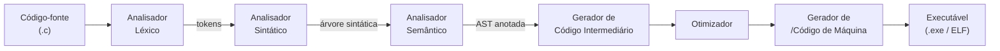

# Conceitos Base da Computação

## 1. Introdução

Antes de mergulharmos no estudo das linguagens formais e dos autômatos, é fundamental compreender os alicerces sobre os quais toda a Ciência da Computação se apoia. Assim como a Matemática precisa de axiomas antes de teoremas, a Computação precisa de conceitos fundamentais antes de modelos formais.

Este capítulo não pressupõe conhecimento prévio de programação ou de hardware. Seu objetivo é apresentar, de forma gradual e precisa, as ideias centrais que definem o que é um computador, como ele representa e processa informação, e quais abstrações nos permitem raciocinar sobre sistemas computacionais de maneira independente de sua implementação física.

Como observa Aho, Lam, Sethi e Ullman (2008), "um compilador deve entender completamente a linguagem que compila; da mesma forma, quem estuda computação deve entender completamente o que *significa* computar".

---

## 2. O Que É um Computador?

### 2.1 Definição Informal

Em seu sentido mais amplo, um **computador** é qualquer dispositivo capaz de receber dados de entrada, processá-los segundo um conjunto de instruções e produzir resultados de saída. Essa definição é intencionalmente abrangente: ela engloba desde um ábaco manual até um supercomputador moderno.

### 2.2 Modelo Clássico: Arquitetura de von Neumann

O modelo mais influente para computadores digitais modernos foi proposto em 1945 por **John von Neumann** (1903–1957). Neste modelo, um computador é composto por cinco componentes principais:

| Componente | Função |
|------------|--------|
| Unidade de Controle (UC) | Busca e decodifica instruções |
| Unidade Lógica e Aritmética (ULA) | Executa operações numéricas e lógicas |
| Memória | Armazena dados e instruções |
| Dispositivos de Entrada | Recebem dados do mundo externo |
| Dispositivos de Saída | Comunicam resultados ao mundo externo |

A característica mais importante desse modelo é o **programa armazenado**: dados e instruções residem na mesma memória e são tratados de forma uniforme. Isso distingue o computador moderno de máquinas de propósito específico: alterando o programa, alteram-se completamente as capacidades do mesmo hardware.

```
┌──────────────────────────────────────────────┐
│                  Memória                      │
│   [ instruções | dados | pilha | heap ]       │
└───────────────┬──────────────────────────────┘
                │
       ┌────────▼────────┐
       │  Unidade Central│
       │  de Processamento│
       │  ┌──────────┐   │
       │  │  UC (PC) │   │
       │  └──────────┘   │
       │  ┌──────────┐   │
       │  │  ULA     │   │
       │  └──────────┘   │
       └────────┬────────┘
                │
   ┌────────────┴────────────┐
   │                         │
┌──▼──────┐          ┌───────▼──┐
│ Entrada │          │  Saída   │
│ (teclado│          │ (monitor,│
│  sensor)│          │  arquivo)│
└─────────┘          └──────────┘
```

### 2.3 Computador Abstrato vs. Computador Real

Em Ciência da Computação teórica, frequentemente trabalhamos com **modelos abstratos** de computador — como as máquinas de Turing estudadas mais adiante neste curso. Esses modelos capturam a *essência* do que significa computar sem se preocupar com detalhes físicos de velocidade, capacidade de memória ou tecnologia de fabricação.

A distinção entre o modelo abstrato e a realização física é ela própria uma forma de **abstração** — conceito que exploraremos na próxima seção.

---

## 3. Abstração

### 3.1 Definição

**Abstração** é o processo de identificar e isolar as características relevantes de um sistema, ignorando deliberadamente os detalhes que não importam para o problema em questão.

A abstração é talvez o conceito mais poderoso da Ciência da Computação. Ela permite que:

- Programadores escrevam código em linguagens de alto nível sem se preocupar com registradores do processador.
- Usuários utilizem aplicativos sem conhecer sua implementação.
- Teóricos raciocinem sobre o que é computável sem depender de hardware específico.

### 3.2 Níveis de Abstração em Computação

Sistemas computacionais são organizados em **camadas de abstração**, onde cada camada oferece serviços à camada superior e oculta detalhes da camada inferior:

```
┌─────────────────────────────────────┐
│  Aplicações (editores, navegadores) │  ← mais abstrato
├─────────────────────────────────────┤
│  Linguagens de Programação          │
├─────────────────────────────────────┤
│  Sistema Operacional                │
├─────────────────────────────────────┤
│  Conjunto de Instruções (ISA)       │
├─────────────────────────────────────┤
│  Microarquitetura (pipeline, cache) │
├─────────────────────────────────────┤
│  Lógica Digital (portas, flip-flops)│
├─────────────────────────────────────┤
│  Circuitos Elétricos (transistores) │  ← mais concreto
└─────────────────────────────────────┘
```

Cada nível expõe uma **interface** bem definida e esconde os detalhes de sua implementação. Um programador Python não precisa saber como o processador implementa a multiplicação de inteiros; um engenheiro de hardware não precisa conhecer a semântica de loops `for`.

### 3.3 Tipos de Abstração

**Abstração de dados:** Oculta a representação interna de um dado, expondo apenas as operações que podem ser realizadas sobre ele. Exemplo: um número inteiro pode ser internamente representado em complemento de dois, mas o programador trabalha apenas com operações aritméticas.

**Abstração procedural:** Oculta os detalhes de como uma tarefa é realizada, expondo apenas o que ela faz. Uma função `ordenar(lista)` pode usar quicksort, mergesort ou bubblesort internamente — o chamador não precisa saber.

**Abstração de controle:** Permite expressar fluxos de controle complexos (loops, recursão, exceções) sem se preocupar com os saltos de máquina correspondentes.

**Abstração de processos:** O sistema operacional oferece a ilusão de múltiplos programas rodando simultaneamente, independentemente do número físico de processadores.

### 3.4 Abstração em Linguagens Formais

No contexto deste curso, os autômatos finitos e as gramáticas são **abstrações de reconhecedores e geradores de linguagens**. Uma máquina de Turing é uma abstração de *qualquer* computador possível. Quando provamos que algo não pode ser feito por uma máquina de Turing, estamos provando que nenhum computador real — independentemente de tecnologia — pode fazê-lo.

---

## 4. Informação e Sua Representação

### 4.1 O Que É Informação?

**Informação** é qualquer dado que reduz a incerteza sobre alguma coisa. No contexto computacional, toda informação — texto, imagens, sons, vídeos, programas — é representada internamente por sequências de **bits** (dígitos binários: 0 ou 1).

A escolha do sistema binário não é acidental: circuitos eletrônicos distinguem facilmente dois estados (tensão alta / tensão baixa), mas teriam dificuldade em distinguir dez estados de forma confiável. O sistema binário oferece a máxima robustez física com a mínima complexidade eletrônica.

### 4.2 Bit, Byte e Múltiplos

| Unidade | Definição | Valor Típico |
|---------|-----------|--------------|
| **Bit** | Dígito binário (0 ou 1) | Menor unidade de informação |
| **Nibble** | 4 bits | Representa um dígito hexadecimal |
| **Byte** | 8 bits | 256 valores distintos (0 a 255) |
| **Kilobyte (KB)** | 1.024 bytes (2¹⁰) | ~1.000 bytes |
| **Megabyte (MB)** | 1.024 KB (2²⁰) | ~1.000.000 bytes |
| **Gigabyte (GB)** | 1.024 MB (2³⁰) | ~10⁹ bytes |
| **Terabyte (TB)** | 1.024 GB (2⁴⁰) | ~10¹² bytes |

### 4.3 Sistema Binário

Um número no **sistema binário** (base 2) utiliza apenas os dígitos 0 e 1. Cada posição representa uma potência de 2:

```
1 0 1 1 0 1 (base 2)
│ │ │ │ │ └── 2⁰ = 1  × 1 =  1
│ │ │ │ └──── 2¹ = 2  × 0 =  0
│ │ │ └────── 2² = 4  × 1 =  4
│ │ └──────── 2³ = 8  × 1 =  8
│ └────────── 2⁴ = 16 × 0 =  0
└──────────── 2⁵ = 32 × 1 = 32
                             ──
                             45 (base 10)
```

Portanto, 101101₂ = 45₁₀.

**Conversão decimal → binário** (divisões sucessivas por 2):

```
45 ÷ 2 = 22, resto 1   ← bit menos significativo
22 ÷ 2 = 11, resto 0
11 ÷ 2 =  5, resto 1
 5 ÷ 2 =  2, resto 1
 2 ÷ 2 =  1, resto 0
 1 ÷ 2 =  0, resto 1   ← bit mais significativo

Resultado (lendo de baixo para cima): 101101
```

### 4.4 Representação de Inteiros Negativos: Complemento de Dois

Computadores representam inteiros negativos usando o método **complemento de dois**. Para um número de n bits:

- O bit mais significativo (MSB) vale −2^(n−1) (negativo!).
- Os demais bits têm os valores positivos habituais.

**Exemplo com 8 bits:**

| Padrão de bits | Interpretação sem sinal | Interpretação c2 |
|----------------|------------------------|------------------|
| 0000 0000 | 0 | 0 |
| 0111 1111 | 127 | 127 |
| 1000 0000 | 128 | −128 |
| 1111 1111 | 255 | −1 |

**Vantagem:** A adição binária funciona identicamente para positivos e negativos, simplificando o hardware.

### 4.5 Representação de Ponto Flutuante (IEEE 754)

Números reais são representados no padrão **IEEE 754**, que divide os bits em três campos:

```
┌──┬────────────┬───────────────────────────────┐
│S │  Expoente  │         Mantissa              │
│1 │    8 bits  │           23 bits             │
└──┴────────────┴───────────────────────────────┘
           (precisão simples — float de 32 bits)
```

O valor representado é: (−1)^S × 1.Mantissa × 2^(Expoente − 127)

**Implicação importante:** Nem todo número real pode ser representado exatamente. Por exemplo, 0,1 em decimal não tem representação exata em binário — assim como 1/3 não tem representação decimal finita. Isso causa o fenômeno de **erro de arredondamento**, relevante em toda computação numérica.

---

## 5. Tipos de Dados

### 5.1 O Que É um Tipo de Dado?

Um **tipo de dado** (ou simplesmente **tipo**) é uma classificação que define:

1. O conjunto de **valores** que uma variável pode assumir.
2. As **operações** que podem ser aplicadas a esses valores.
3. A **representação** interna (como os bits são organizados).

Os tipos de dados são uma das formas de abstração mais importantes: ao declarar que uma variável é do tipo `int`, o programador não precisa conhecer a representação binária — apenas saber que pode realizar adições, subtrações e comparações.

### 5.2 Tipos Primitivos

**Tipos primitivos** são os blocos fundamentais fornecidos diretamente pelo hardware e pela linguagem de programação. Em linguagem C, os principais são:

| Tipo | Descrição | Tamanho Típico | Valores |
|------|-----------|----------------|---------|
| `char` | Caractere / inteiro pequeno | 1 byte | −128 a 127 (com sinal) ou 0 a 255 (sem sinal) |
| `int` | Inteiro | 4 bytes | −2.147.483.648 a 2.147.483.647 |
| `long` | Inteiro longo | 8 bytes | −9,2 × 10^18 a 9,2 × 10^18 |
| `float` | Ponto flutuante de precisão simples | 4 bytes | ≈ ±3,4 × 10³⁸ (7 dígitos) |
| `double` | Ponto flutuante de precisão dupla | 8 bytes | ≈ ±1,8 × 10^308 (15 dígitos) |
| `_Bool` | Valor booleano | 1 byte | 0 (falso) ou 1 (verdadeiro) |

**Observação:** Os tamanhos acima são os mais comuns em sistemas de 64 bits, mas o padrão C garante apenas tamanhos mínimos. A diretiva `sizeof` permite consultar o tamanho exato em cada plataforma.

### 5.3 Tipos Compostos

**Tipos compostos** são construídos a partir de tipos primitivos:

**Arranjos (arrays):** Sequência de elementos do mesmo tipo, armazenados contiguamente na memória. Em C:

```c
int notas[5] = {7, 8, 9, 6, 10}; /* arranjo de 5 inteiros */
```

**Estruturas (structs):** Agrupamento de campos possivelmente de tipos distintos:

```c
typedef struct {
    char nome[50];
    int  idade;
    float altura;
} Pessoa;
```

**Uniões (unions):** Campos que compartilham o mesmo espaço de memória (apenas um campo está "ativo" por vez). Úteis para interpretar os mesmos bits de formas diferentes.

**Ponteiros:** Armazenam o **endereço de memória** de outro dado. São o mecanismo fundamental para estruturas dinâmicas (listas encadeadas, árvores, grafos) em C.

### 5.4 Tipos Abstratos de Dados (TAD)

Um **Tipo Abstrato de Dados** (TAD) define um tipo exclusivamente por meio de sua **interface** (as operações disponíveis) e de seu **comportamento** (o que cada operação faz), sem especificar a implementação.

Exemplos clássicos:

| TAD | Operações principais | Implementações possíveis |
|-----|---------------------|--------------------------|
| **Pilha** | empilha, desempilha, topo, vazia | arranjo ou lista encadeada |
| **Fila** | enfileira, desenfileira, frente, vazia | arranjo circular ou lista |
| **Conjunto** | insere, remove, pertence, união, interseção | árvore, tabela hash, vetor de bits |
| **Dicionário** | insere(chave, valor), busca(chave), remove | árvore AVL, tabela hash |

A separação entre interface e implementação é a essência da abstração de dados. Um TAD permite que o código cliente seja escrito sem conhecer (ou se comprometer com) qualquer implementação particular.

### 5.5 Tipos e Linguagens Formais

O conceito de tipo tem uma conexão profunda com as linguagens formais. Em linguagens de programação com tipagem estática, o **verificador de tipos** é essencialmente um **reconhecedor de linguagem**:

- As expressões bem tipadas formam uma **linguagem** sobre o alfabeto dos tokens do programa.
- O sistema de tipos define uma **gramática** que aceita expressões corretas e rejeita as incorretas.
- Compiladores modernos usam autômatos e gramáticas livres de contexto para verificar tipos — exatamente os modelos que estudaremos neste curso.

---

## 6. Algoritmos

### 6.1 Definição

Um **algoritmo** é uma sequência finita de instruções bem definidas e não ambíguas que, executada por um agente computacional, resolve um problema ou realiza uma tarefa em tempo finito.

Os elementos essenciais de um algoritmo são:

- **Finitude:** o algoritmo deve terminar após um número finito de passos.
- **Definitude:** cada instrução deve ser precisa e não ambígua.
- **Entrada:** zero ou mais valores fornecidos ao algoritmo.
- **Saída:** um ou mais valores produzidos como resultado.
- **Efetividade:** cada passo deve ser suficientemente simples para ser executado por um agente com recursos limitados.

### 6.2 Algoritmo vs. Programa

Um **programa** é a realização de um algoritmo em uma linguagem de programação específica. O mesmo algoritmo pode ser implementado em C, Python, Java ou assembly. A escolha da linguagem afeta eficiência e clareza, mas não a correção do algoritmo.

### 6.3 Complexidade e Limites

Nem todo problema possui um algoritmo que o resolva. Alguns problemas são **indecidíveis** — não existe nenhum algoritmo, independentemente do poder computacional disponível, que os resolva corretamente para todas as entradas. O exemplo mais célebre é o **Problema da Parada** (*Halting Problem*), provado indecidível por Alan Turing em 1936.

Outros problemas são decidíveis, mas **intratáveis** — os algoritmos conhecidos requerem tempo ou espaço exponencial no tamanho da entrada, tornando-os impraticáveis para instâncias grandes. A questão de se P = NP — se todo problema cuja solução pode ser verificada eficientemente também pode ser resolvido eficientemente — é um dos maiores problemas em aberto da Ciência da Computação.

---

## 7. Memória e Armazenamento

### 7.1 Hierarquia de Memória

Computadores modernos organizam a memória em uma **hierarquia**, balanceando velocidade e capacidade:

```
                    Custo por bit (↑ maior)
                    Velocidade (↑ maior)
                    Capacidade (↓ menor)
                         │
                    ┌────▼────┐
                    │Registros│  ← dezenas de bytes, < 1 ns
                    └────┬────┘
                    ┌────▼────┐
                    │  Cache  │  ← MBs, 1–10 ns
                    │ (L1/L2/L3)│
                    └────┬────┘
                    ┌────▼────┐
                    │  RAM    │  ← GBs, ~100 ns
                    └────┬────┘
                    ┌────▼────┐
                    │  SSD    │  ← TBs, ~0,1 ms
                    └────┬────┘
                    ┌────▼────┐
                    │  HDD    │  ← TBs, ~10 ms
                    └─────────┘
```

### 7.2 Memória Principal (RAM)

A **memória de acesso aleatório** (RAM) é o espaço de trabalho do processador. Cada byte possui um **endereço** único — um número inteiro que o identifica. O processador lê e escreve dados na RAM usando esses endereços.

Em um programa C, variáveis, arrays e estruturas residem na RAM. O operador `&` retorna o endereço de uma variável:

```c
int x = 42;
printf("Endereço de x: %p\n", (void *)&x);
```

### 7.3 Modelo de Memória de um Processo

Quando um programa é executado, o sistema operacional aloca um espaço de endereçamento virtual dividido em segmentos:

```
┌──────────────────────────┐  endereços altos
│  Pilha (stack)            │  ← variáveis locais, parâmetros
│  ↓ cresce para baixo      │
├──────────────────────────┤
│  (espaço não utilizado)   │
├──────────────────────────┤
│  Heap ↑ cresce para cima  │  ← alocação dinâmica (malloc)
├──────────────────────────┤
│  Dados (globais/estáticos)│
├──────────────────────────┤
│  Texto (código do programa│
└──────────────────────────┘  endereços baixos
```

---

## 8. Hardware e Software

### 8.1 Hardware

**Hardware** é o conjunto de componentes físicos de um sistema computacional: processador, memória, discos, placas de rede, periféricos. O hardware executa instruções de máquina — sequências de bits que especificam operações elementares (soma, comparação, salto condicional, leitura de memória).

### 8.2 Software

**Software** é o conjunto de programas e dados que instruem o hardware a realizar tarefas específicas. Divide-se em:

- **Software de sistema:** Sistema operacional, compiladores, linkers, gerenciadores de arquivos. Gerencia recursos de hardware e oferece serviços a aplicações.
- **Software de aplicação:** Navegadores, editores, jogos, bancos de dados. Resolve problemas diretamente para o usuário final.

### 8.3 O Processo de Compilação

Um **compilador** transforma um programa escrito em linguagem de alto nível em instruções de máquina. O processo envolve diversas fases, várias das quais fazem uso direto de linguagens formais e autômatos:



- O **analisador léxico** usa **autômatos finitos** para reconhecer tokens (palavras-chave, identificadores, números).
- O **analisador sintático** usa **gramáticas livres de contexto** para verificar a estrutura do programa.
- O **analisador semântico** verifica tipos e escopo — conectando-se novamente à teoria das linguagens formais.

Esta cadeia é a motivação central para este curso: as linguagens formais e os autômatos não são abstração pura — eles são as ferramentas que tornam possível a construção de compiladores, interpretadores e ferramentas de análise de código.

---

## 9. Codificação de Caracteres

### 9.1 ASCII

O padrão **ASCII** (*American Standard Code for Information Interchange*, 1963) atribui a cada caractere um número de 7 bits (0 a 127). Os primeiros 32 códigos são caracteres de controle não imprimíveis; os demais são letras, dígitos e símbolos:

| Código | Caractere | Código | Caractere |
|--------|-----------|--------|-----------|
| 48 | `'0'` | 65 | `'A'` |
| 49 | `'1'` | 97 | `'a'` |
| 57 | `'9'` | 122 | `'z'` |
| 32 | `' '` (espaço) | 10 | `'\n'` (nova linha) |

Em C, `'A'` e `65` são equivalentes. A diferença entre maiúscula e minúscula é sempre 32 (`'a' - 'A' == 32`), o que permite conversões simples com operações de bit.

### 9.2 Unicode e UTF-8

O ASCII é insuficiente para representar os alfabetos do mundo. O padrão **Unicode** define códigos (chamados *code points*) para mais de 140.000 caracteres, cobrindo praticamente todos os sistemas de escrita humanos.

A codificação **UTF-8** representa cada *code point* Unicode usando 1 a 4 bytes, mantendo compatibilidade retroativa com o ASCII (caracteres ASCII têm a mesma representação em UTF-8). É a codificação dominante na web e em sistemas modernos.

---

## 10. Sistemas de Numeração

### 10.1 Por Que Múltiplos Sistemas?

Embora computadores operem internamente em binário, é conveniente para programadores usar outros sistemas de numeração que sejam mais compactos e legíveis:

| Sistema | Base | Dígitos | Uso |
|---------|------|---------|-----|
| **Binário** | 2 | 0, 1 | Representação interna |
| **Octal** | 8 | 0–7 | Permissões Unix, antigas linguagens |
| **Decimal** | 10 | 0–9 | Interface humana |
| **Hexadecimal** | 16 | 0–9, A–F | Endereços, cores, códigos de erro |

### 10.2 Hexadecimal

O sistema **hexadecimal** (base 16) usa os dígitos 0–9 e as letras A–F. Cada dígito hexadecimal representa exatamente 4 bits (um nibble), tornando a conversão com binário imediata:

```
0x2A  =  2    ×  A
       0010   1010  (binário)
       = 32 + 10 = 42 (decimal)
```

Em C, literais hexadecimais são prefixados com `0x`:

```c
int mascara = 0xFF;    /* 255 em decimal = 11111111 em binário */
int cor_vermelho = 0xFF0000;
```

### 10.3 Conversão entre Bases

**Decimal → Outra Base:** divisões sucessivas pela base, coletando os restos de baixo para cima.

**Outra Base → Decimal:** multiplicar cada dígito pelo peso posicional e somar.

**Binário ↔ Hexadecimal:** agrupar bits de 4 em 4 (da direita para a esquerda) e converter cada grupo.

```
1111 0011 1010 0101 (binário)
  F    3    A    5  (hexadecimal)
= 0xF3A5
```

---

## Referências

AHO, A. V.; LAM, M. S.; SETHI, R.; ULLMAN, J. D. **Compiladores: Princípios, Técnicas e Ferramentas**. Tradução da 2ª edição. São Paulo: Pearson, 2008. Título original: *Compilers: Principles, Techniques, and Tools*.

HENNESSY, J. L.; PATTERSON, D. A. **Organização e Projeto de Computadores: A Interface Hardware/Software**. Tradução da 5ª edição. Rio de Janeiro: Elsevier, 2017. Título original: *Computer Organization and Design*.

SIPSER, M. **Introdução à Teoria da Computação**. Tradução da 3ª edição. São Paulo: Cengage Learning, 2012. Título original: *Introduction to the Theory of Computation*.

TANENBAUM, A. S.; BOS, H. **Sistemas Operacionais Modernos**. Tradução da 4ª edição. São Paulo: Pearson, 2016. Título original: *Modern Operating Systems*.

CORMEN, T. H.; LEISERSON, C. E.; RIVEST, R. L.; STEIN, C. **Algoritmos: Teoria e Prática**. Tradução da 3ª edição. Rio de Janeiro: Elsevier, 2012. Título original: *Introduction to Algorithms*.

IEEE 754-2019. **IEEE Standard for Floating-Point Arithmetic**. New York: IEEE, 2019.

UNICODE CONSORTIUM. **The Unicode Standard, Version 15.0**. Mountain View, CA: Unicode Consortium, 2022. Disponível em: <https://www.unicode.org/versions/Unicode15.0.0/>.
