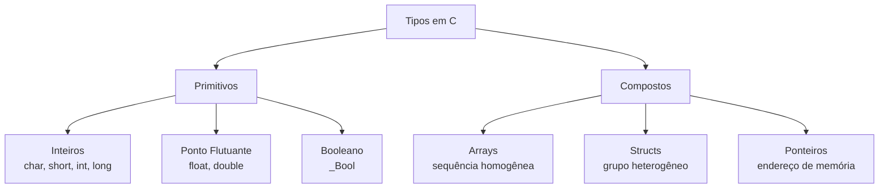
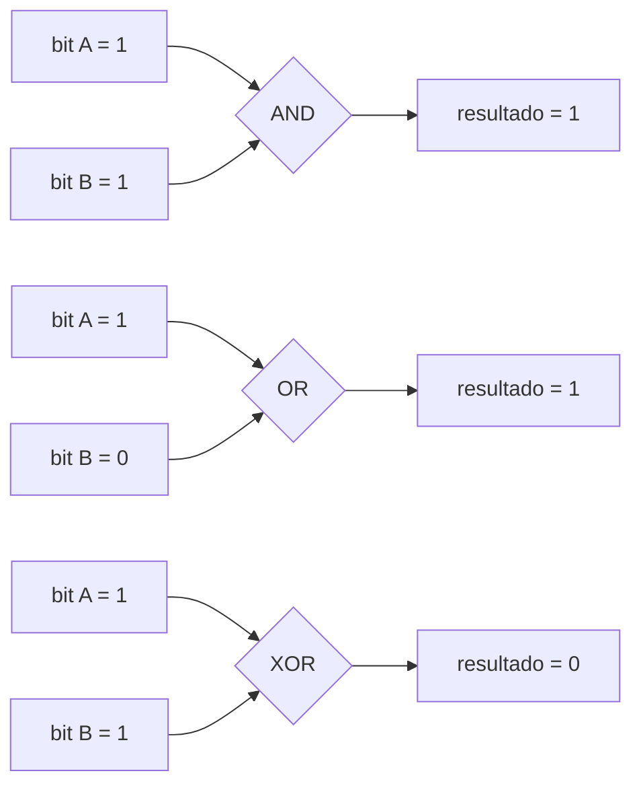

# Conceitos Base da Computação

Este diretório contém implementações dos conceitos fundamentais da computação que precedem o estudo de linguagens formais e autômatos.

## 📚 Conteúdo

- **tipos_dados.c** — Tipos primitivos, compostos e abstratos em C
- **representacao_binaria.c** — Sistemas de numeração e operações bit a bit

## 🎯 Objetivos de Aprendizado

Compreender os fundamentos sobre os quais a Ciência da Computação se apoia:
- Representação de informação em bits e bytes
- Tipos de dados e suas limitações
- Sistemas de numeração (binário, octal, decimal, hexadecimal)
- Operações bit a bit como base das operações computacionais

---

## 1. Tipos de Dados (tipos_dados.c)

### O que o código faz?

Este programa demonstra os tipos primitivos da linguagem C, seus tamanhos, limites, e como dados são internamente armazenados.

### Conceitos Demonstrados

#### Tipos Primitivos e seus Tamanhos

```
char   : 1 byte  → 256 valores distintos
short  : 2 bytes → 65.536 valores distintos
int    : 4 bytes → 4.294.967.296 valores distintos
long   : 8 bytes → 2⁶⁴ valores distintos (~−9,2 × 10¹⁸ a ~9,2 × 10¹⁸)
float  : 4 bytes → ~7 dígitos significativos
double : 8 bytes → ~15 dígitos significativos
```

#### Complemento de Dois

```
Representação com 8 bits:
  0000 0000  →   0
  0111 1111  → 127
  1000 0000  → -128  (o MSB vale -128, não +128)
  1111 1111  →  -1
```

#### Diagrama: Hierarquia de Tipos



### Para Executar

```bash
make bin/tipos_dados
./bin/tipos_dados
```

---

## 2. Representação Binária (representacao_binaria.c)

### O que o código faz?

Este programa demonstra como computadores representam números em binário e hexadecimal, e como funcionam as operações bit a bit.

### Conversão entre Bases

```
Decimal → Binário (divisões por 2):
  42 ÷ 2 = 21, resto 0
  21 ÷ 2 = 10, resto 1
  10 ÷ 2 =  5, resto 0
   5 ÷ 2 =  2, resto 1
   2 ÷ 2 =  1, resto 0
   1 ÷ 2 =  0, resto 1
  Resultado (baixo→cima): 101010  → 42₁₀ = 101010₂ = 0x2A
```

### Operações Bit a Bit

```
A     = 1011 0100  (180)
B     = 0110 1110  (110)

A AND B = 0010 0100  (36)  — bit 1 apenas onde ambos são 1
A OR  B = 1111 1110  (254) — bit 1 onde ao menos um é 1
A XOR B = 1001 1010  (154) — bit 1 onde são diferentes
NOT A   = 0100 1011  (75)  — inverte todos os bits
```

#### Diagrama: Operações AND e OR



### Máscaras de Bits

Técnica essencial para manipular flags individuais em um byte:

```
flags = 1011 0010

Verificar bit 4:  (flags >> 4) & 1  →  1
Ligar   bit 0:   flags | 0x01       →  1011 0011
Desligar bit 7:  flags & ~0x80      →  0011 0010
Alternar bit 1:  flags ^ 0x02       →  1011 0000
```

### Para Executar

```bash
make bin/representacao_binaria
./bin/representacao_binaria
```

---

## 🔗 Por que isso é importante?

Esses conceitos são a base para:
- **Tipos de dados em linguagens formais**: alfabetos são conjuntos de símbolos; símbolos têm representação binária
- **Autômatos**: estados são identificados por inteiros; transições podem ser codificadas em tabelas de bits
- **Compiladores**: análise léxica manipula caracteres (ASCII/Unicode); tabelas de símbolos usam tipos compostos
- **Criptografia e segurança**: operações XOR e máscaras são primitivas de cifragem

## 📖 Referências

- Os tipos primitivos seguem o padrão ISO C99 (`<limits.h>`, `<float.h>`)
- A representação em complemento de dois é mandatória no padrão C desde C23 (e era universal na prática antes)
- O padrão IEEE 754-2019 define a representação de ponto flutuante
