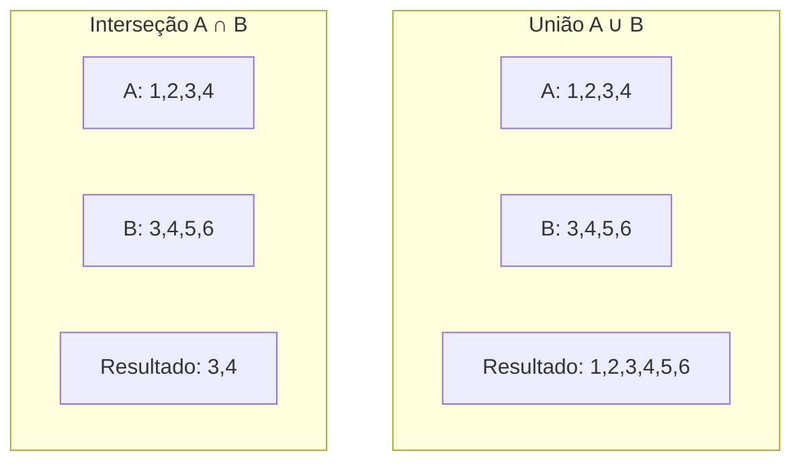
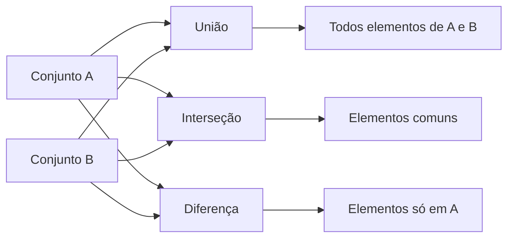
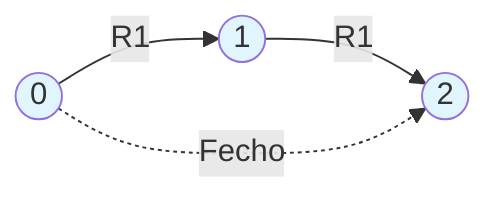

# Conceitos Matemáticos para Linguagens Formais

Este diretório contém implementações dos conceitos matemáticos fundamentais usados no estudo de linguagens formais e autômatos.

## 📚 Conteúdo

- **conjuntos.c** - Operações com conjuntos
- **relacoes.c** - Relações binárias e suas propriedades

## 🎯 Objetivos de Aprendizado

Compreender os fundamentos matemáticos necessários para o estudo de linguagens formais:
- Operações básicas com conjuntos
- Propriedades de relações binárias
- Fecho transitivo

---

## 1. Operações com Conjuntos (conjuntos.c)

### O que o código faz?

Este programa demonstra as operações fundamentais da teoria dos conjuntos, que são essenciais para trabalhar com linguagens formais.

### Operações Implementadas

#### União (A ∪ B)
Combina todos os elementos de dois conjuntos, sem duplicatas.

```
A = {1, 2, 3, 4}
B = {3, 4, 5, 6}
A ∪ B = {1, 2, 3, 4, 5, 6}
```

#### Interseção (A ∩ B)
Contém apenas os elementos que estão em ambos os conjuntos.

```
A ∩ B = {3, 4}
```

#### Diferença (A - B)
Elementos que estão em A mas não estão em B.

```
A - B = {1, 2}
B - A = {5, 6}
```

#### Complemento (Ā)
Elementos do universo U que não estão em A.

```
U = {1, 2, 3, 4, 5, 6, 7, 8}
Ā = {5, 6, 7, 8}
```

### Diagrama de Venn



### Como Funciona



### Conceitos-chave

- **Conjunto**: Coleção de elementos únicos (sem repetições)
- **Pertinência**: Elemento `x ∈ A` significa que x pertence ao conjunto A
- **Universo (U)**: Conjunto que contém todos os elementos considerados

### Para Executar

```bash
make bin/conjuntos
./bin/conjuntos
```

---

## 2. Relações Binárias (relacoes.c)

### O que o código faz?

Este programa trabalha com relações entre elementos de um conjunto, verificando propriedades importantes como reflexividade, simetria e transitividade.

### Propriedades de Relações

#### 1. Reflexividade
Uma relação R é reflexiva se todo elemento se relaciona consigo mesmo.

```
∀a ∈ S, (a,a) ∈ R
```

**Exemplo**: A relação "é igual a" é reflexiva (todo número é igual a si mesmo).

#### 2. Simetria
Se a se relaciona com b, então b se relaciona com a.

```
Se (a,b) ∈ R então (b,a) ∈ R
```

**Exemplo**: A relação "é irmão de" é simétrica.

#### 3. Transitividade
Se a se relaciona com b, e b se relaciona com c, então a se relaciona com c.

```
Se (a,b) ∈ R e (b,c) ∈ R então (a,c) ∈ R
```

**Exemplo**: A relação "é ancestral de" é transitiva.

### Visualização de Relação



Para a relação R1 = {(0,1), (1,2)}:
- **Não é reflexiva**: falta (0,0), (1,1), (2,2)
- **Não é simétrica**: falta (1,0), (2,1)
- **Não é transitiva**: falta (0,2)

### Fecho Transitivo (Algoritmo de Warshall)

O fecho transitivo R+ é a menor relação transitiva que contém R.

```mermaid
flowchart TD
    A[Relação R = {0→1, 1→2}] --> W[Algoritmo de Warshall]
    W --> B[Para cada k]
    B --> C[Para cada i,j]
    C --> D{Existe caminho<br/>i→k→j?}
    D -->|Sim| E[Adiciona i→j]
    D -->|Não| F[Continua]
    E --> G[R+ = {0→1, 1→2, 0→2}]
    F --> G
```

### Matriz de Relação

As relações podem ser representadas como matrizes booleanas:

```
R[i][j] = 1  se (i,j) ∈ R
R[i][j] = 0  caso contrário
```

### Para Executar

```bash
make bin/relacoes
./bin/relacoes
```

---

## 🔗 Por que isso é importante?

Esses conceitos matemáticos são a base para:
- **Autômatos**: Estados e transições são relações
- **Linguagens**: Definidas como conjuntos de palavras
- **Gramáticas**: Regras de derivação são relações
- **Fechos**: Operações de fecho em autômatos

## 📖 Referências

- Conjunto Universal é fundamental para definir linguagens complementares
- Relações transitivas aparecem em fechos de autômatos
- Propriedades de relações são usadas em equivalência de estados
