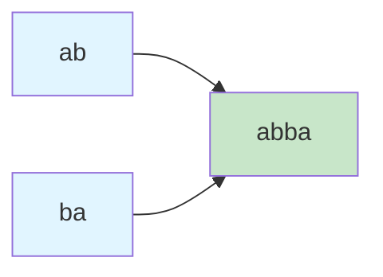
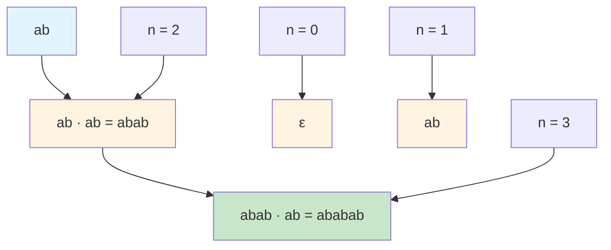
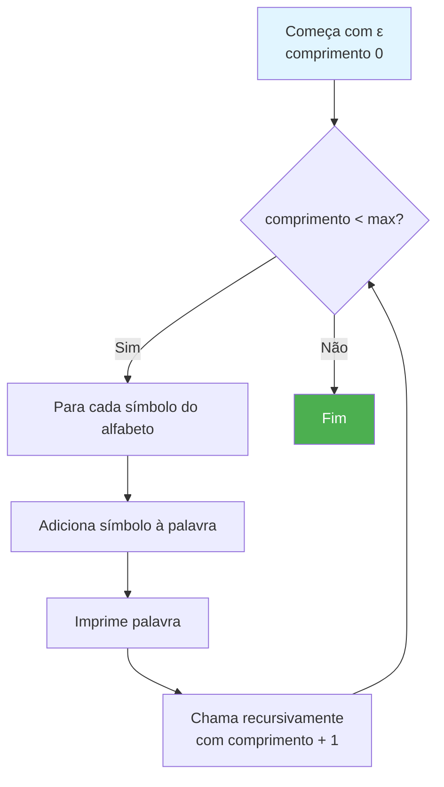

# Alfabetos, Palavras e Linguagens

Este diretório contém implementações dos conceitos fundamentais sobre alfabetos, palavras e linguagens formais.

## 📚 Conteúdo

- **linguagens.c** - Operações com palavras e fecho de Kleene

## 🎯 Objetivos de Aprendizado

Compreender os blocos básicos de construção das linguagens formais:
- Alfabetos e símbolos
- Palavras e suas operações
- Fecho de Kleene

---

## Alfabetos, Palavras e Linguagens (linguagens.c)

### Conceitos Fundamentais

#### Alfabeto (Σ)
Conjunto **finito** e **não vazio** de símbolos.

```
Σ = {a, b}
Σ = {0, 1}
Σ = {a, b, c, ..., z}
```

#### Palavra (w)
Sequência **finita** de símbolos do alfabeto.

```
w = "abba"
w = "010101"
w = ε (palavra vazia)
```

#### Linguagem (L)
Conjunto de palavras sobre um alfabeto.

```
L = {ab, aabb, aaabbb, ...}
L = {palavras que começam com 'a'}
L = Σ* (todas as palavras possíveis)
```

### Operações com Palavras

```mermaid
flowchart TD
    A[Palavra: abba] --> B[Comprimento<br/>|w| = 4]
    A --> C[Reverso<br/>w^R = abba]
    A --> D[Concatenação<br/>abba · ba = abbaba]
    A --> E[Potência<br/>w^3 = abbaabbaabba]
    
    style A fill:#e1f5ff
    style B fill:#fff4e1
    style C fill:#fff4e1
    style D fill:#fff4e1
    style E fill:#fff4e1
```

### 1. Comprimento de uma Palavra

O comprimento |w| é o número de símbolos na palavra.

```
|"abba"| = 4
|"a"| = 1
|ε| = 0  (palavra vazia)
```

### 2. Reverso de uma Palavra (w^R)

Inverte a ordem dos símbolos.

```
("abc")^R = "cba"
("abba")^R = "abba"  (palíndromo)
(ε)^R = ε
```

### 3. Concatenação (w₁ · w₂)

Junta duas palavras em sequência.

```
"ab" · "ba" = "abba"
w · ε = ε · w = w  (ε é o elemento neutro)
|w₁ · w₂| = |w₁| + |w₂|
```



**Propriedades**:
- **Associativa**: (u·v)·w = u·(v·w)
- **Não comutativa**: geralmente u·v ≠ v·u
- **Elemento neutro**: ε

### 4. Potência de uma Palavra (w^n)

Concatena a palavra consigo mesma n vezes.

```
w^0 = ε
w^1 = w
w^2 = w · w
w^3 = w · w · w
```

**Exemplo**: ("ab")^3 = "ababab"



### 5. Fecho de Kleene (Σ*)

Conjunto de **todas as palavras possíveis** sobre o alfabeto Σ, incluindo a palavra vazia.

```
Σ* = {ε} ∪ Σ¹ ∪ Σ² ∪ Σ³ ∪ ...
```

**Para Σ = {a, b}:**

```
Comprimento 0: ε
Comprimento 1: a, b
Comprimento 2: aa, ab, ba, bb
Comprimento 3: aaa, aab, aba, abb, baa, bab, bba, bbb
...
```

```mermaid
graph TD
    A[Σ = {a, b}] --> B[Σ⁰ = {ε}]
    A --> C[Σ¹ = {a, b}]
    A --> D[Σ² = {aa, ab, ba, bb}]
    A --> E[Σ³ = {aaa, aab, ...}]
    A --> F[...]
    
    B --> G[Σ* = união infinita]
    C --> G
    D --> G
    E --> G
    F --> G
    
    style A fill:#e1f5ff
    style G fill:#c8e6c9
```

**Cardinalidade**: Para um alfabeto com |Σ| = k símbolos:
- Palavras de comprimento n: k^n
- Palavras até comprimento n: k^0 + k^1 + ... + k^n

**Exemplo** (Σ = {a, b}):
- Comprimento 0 a 3: 1 + 2 + 4 + 8 = 15 palavras

### Fecho Positivo (Σ+)

Todas as palavras **exceto** a palavra vazia:

```
Σ+ = Σ* - {ε} = Σ¹ ∪ Σ² ∪ Σ³ ∪ ...
```

### Como o Código Funciona

```mermaid
flowchart TD
    Start[Início] --> A[Define alfabeto Σ = {a,b}]
    A --> B[Demonstra comprimento]
    B --> C[Demonstra reverso]
    C --> D[Demonstra concatenação]
    D --> E[Demonstra potência]
    E --> F[Gera Σ* até comprimento 3]
    F --> End[Fim]
    
    style Start fill:#4caf50,color:#fff
    style End fill:#4caf50,color:#fff
    style A fill:#e1f5ff
    style F fill:#c8e6c9
```

### Algoritmo de Geração do Fecho de Kleene



### Para Executar

```bash
make bin/linguagens
./bin/linguagens
```

### Exemplo de Saída

```
Alfabeto Σ = {a, b}

Palavra w1 = "abba"
|w1| = 4

Reverso de "abba" = "abba"

Concatenação: "ab" · "ba" = "abba"

Potência de "ab":
  ("ab")^0 = ""
  ("ab")^1 = "ab"
  ("ab")^2 = "abab"
  ("ab")^3 = "ababab"

Fecho de Kleene Σ*:
  ε
  a
  b
  aa
  ab
  ba
  bb
  ...
```

---

## 🔗 Por que isso é importante?

Esses conceitos são fundamentais para:
- **Definir linguagens formais**: Uma linguagem é um subconjunto de Σ*
- **Expressões regulares**: Usam concatenação, união e fecho de Kleene
- **Autômatos**: Processam palavras símbolo por símbolo
- **Gramáticas**: Geram palavras através de derivações

## 💡 Conceitos-chave

- **Σ*** contém **infinitas** palavras (mas cada palavra é finita)
- A palavra vazia **ε** é diferente do conjunto vazio **∅**
- Concatenação **não é comutativa**: ab ≠ ba (em geral)
- O fecho de Kleene é **fechado** sob concatenação

## 📖 Aplicações

- **Compiladores**: Análise léxica trabalha com palavras do código
- **Expressões Regulares**: Baseadas em Σ*, concatenação e união
- **Protocolos**: Mensagens são palavras sobre alfabetos específicos
- **Bioinformática**: DNA como palavras sobre Σ = {A, C, G, T}
