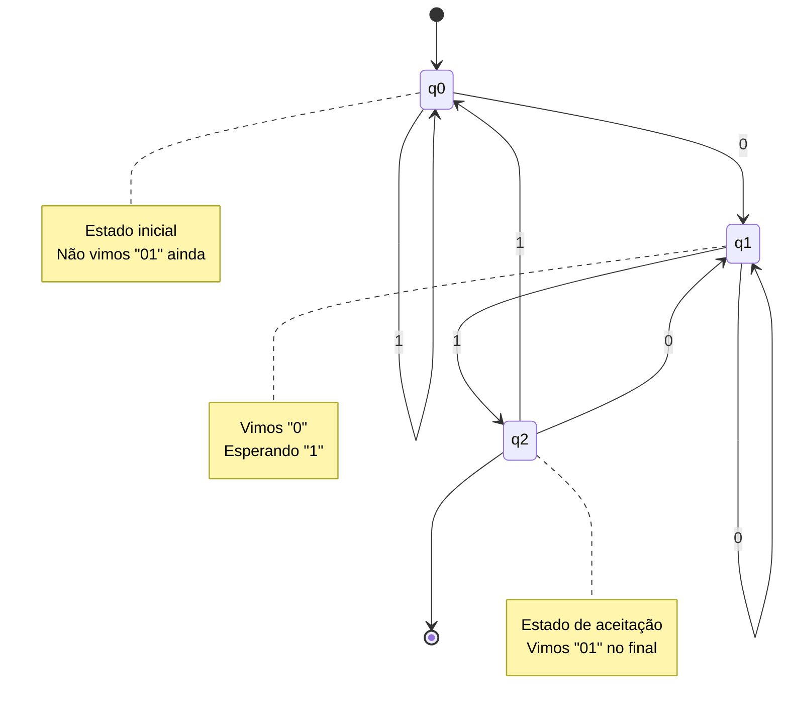
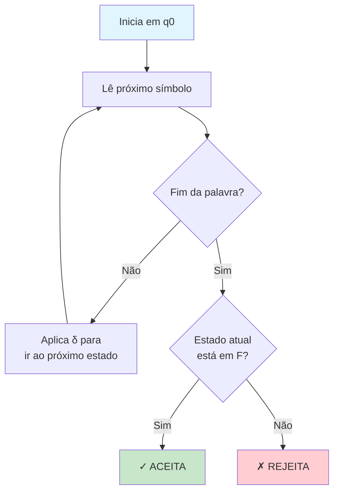
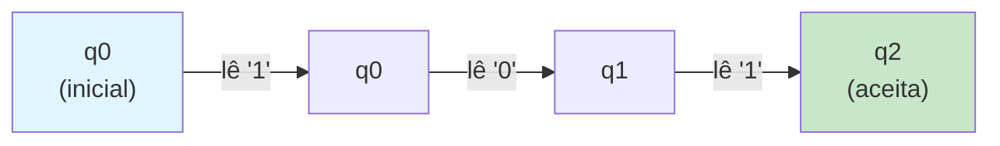
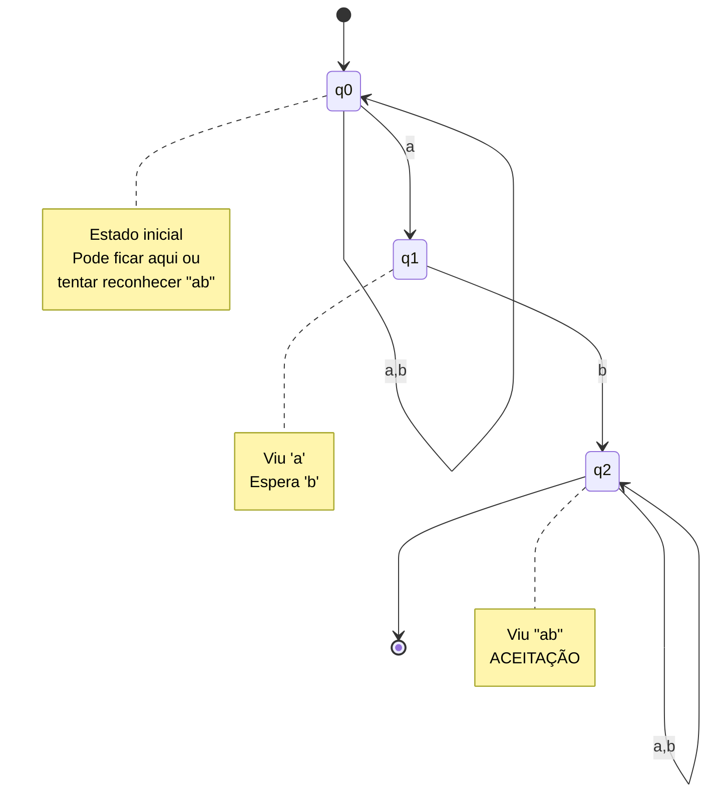
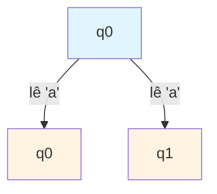
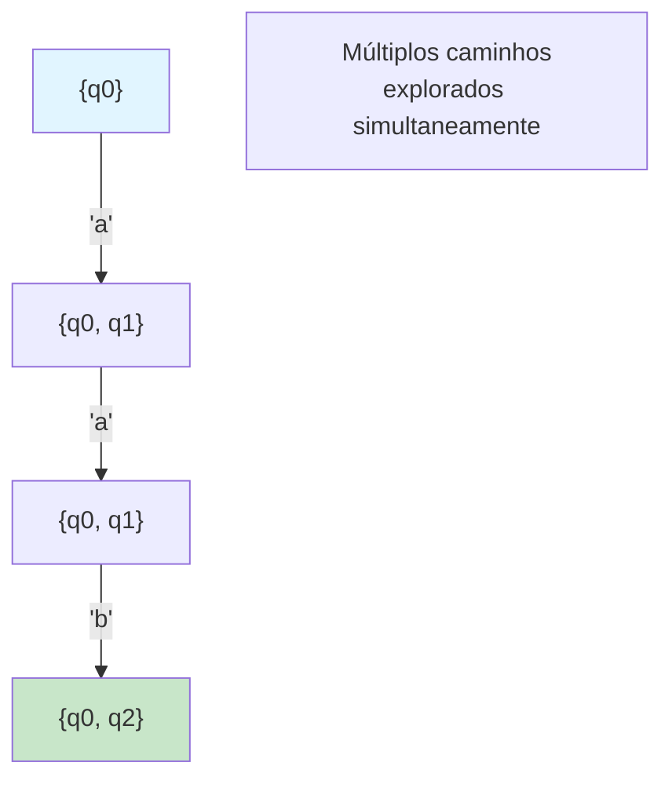
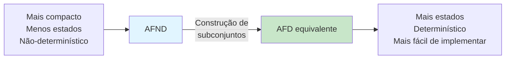

# Autômatos Finitos

Este diretório contém implementações de Autômatos Finitos Determinísticos (AFD) e Não-Determinísticos (AFND).

## 📚 Conteúdo

- **afd.c** - Autômato Finito Determinístico que reconhece cadeias terminadas em "01"
- **afnd.c** - Autômato Finito Não-Determinístico que reconhece cadeias contendo "ab"

## 🎯 Objetivos de Aprendizado

- Entender a diferença entre determinismo e não-determinismo
- Simular autômatos finitos
- Reconhecer linguagens regulares

---

## 1. Autômato Finito Determinístico - AFD (afd.c)

### O que é um AFD?

Um **Autômato Finito Determinístico (AFD)** é uma máquina que lê uma palavra símbolo por símbolo e decide se aceita ou rejeita essa palavra.

**Características**:
- Para cada estado e símbolo, existe **exatamente uma** transição
- Sempre sabemos para onde ir - sem ambiguidade
- É **determinístico**: não há escolhas

### Definição Formal

```
M = (Q, Σ, δ, q₀, F)

Q  = {q0, q1, q2}          Estados
Σ  = {0, 1}                Alfabeto
q₀ = q0                    Estado inicial
F  = {q2}                  Estados de aceitação
δ  = função de transição   Q × Σ → Q
```

### Linguagem Reconhecida

Este AFD reconhece a linguagem:

```
L = {w ∈ {0,1}* | w termina em "01"}
```

**Exemplos**:
- ✓ "101" → ACEITA (termina em 01)
- ✗ "100" → REJEITA (termina em 00)
- ✓ "0001" → ACEITA (termina em 01)
- ✗ "11" → REJEITA (não termina em 01)

### Diagrama de Estados



### Tabela de Transições

```
Estado │  0  │  1
───────┼─────┼─────
→ q0   │ q1  │ q0
  q1   │ q1  │ q2*
  q2*  │ q1  │ q0
```

- `→` marca o estado inicial
- `*` marca estados de aceitação

### Como o AFD Funciona



### Exemplo de Execução: "101"



**Rastreamento**:
1. Estado: q0, Entrada: "101"
2. Lê '1': δ(q0, 1) = q0
3. Lê '0': δ(q0, 0) = q1
4. Lê '1': δ(q1, 1) = q2
5. Fim da entrada, estado q2 ∈ F → **ACEITA**

### Para Executar

```bash
make bin/afd
./bin/afd
```

---

## 2. Autômato Finito Não-Determinístico - AFND (afnd.c)

### O que é um AFND?

Um **Autômato Finito Não-Determinístico (AFND)** permite múltiplas transições para o mesmo símbolo. É como explorar vários caminhos simultaneamente.

**Características**:
- Para um estado e símbolo, pode haver **zero, uma ou várias** transições
- Aceita se **pelo menos um** caminho leva à aceitação
- É **não-determinístico**: há escolhas a fazer

### Diferença entre AFD e AFND

| Aspecto | AFD | AFND |
|---------|-----|------|
| Transições | Uma por (estado, símbolo) | Zero ou mais |
| Execução | Um único caminho | Múltiplos caminhos paralelos |
| Aceitação | Caminho único aceita | Algum caminho aceita |
| Complexidade | Mais estados | Menos estados (mais compacto) |

### Linguagem Reconhecida

Este AFND reconhece:

```
L = {w ∈ {a,b}* | w contém "ab" como subcadeia}
```

**Exemplos**:
- ✓ "ab" → ACEITA (contém ab)
- ✓ "aab" → ACEITA (contém ab)
- ✓ "bab" → ACEITA (contém ab)
- ✗ "aa" → REJEITA (não contém ab)
- ✗ "ba" → REJEITA (não contém ab)

### Diagrama de Estados



### Não-Determinismo Ilustrado

Ao ler 'a' em q0, o AFND pode:
1. Ficar em q0 (loop)
2. Ir para q1 (tentar reconhecer "ab")



**Ambos os caminhos são explorados simultaneamente!**

### Tabela de Transições (Não-Determinística)

```
Estado │    a     │    b
───────┼──────────┼─────────
→ q0   │ {q0, q1} │ {q0}
  q1   │    ∅     │ {q2}
  q2*  │  {q2}    │ {q2}
```

Observe que δ(q0, 'a') retorna um **conjunto de estados** {q0, q1}.

### Como o AFND Funciona

```mermaid
flowchart TD
    A[Começa com conjunto {q0}] --> B[Lê símbolo]
    B --> C[Para cada estado<br/>no conjunto atual]
    C --> D[Aplica δ e coleta<br/>novos estados]
    D --> E{Fim da palavra?}
    E -->|Não| B
    E -->|Sim| F{Algum estado<br/>está em F?}
    F -->|Sim| G[✓ ACEITA]
    F -->|Não| H[✗ REJEITA]
    
    style A fill:#e1f5ff
    style G fill:#c8e6c9
    style H fill:#ffcdd2
```

### Exemplo de Execução: "aab"



**Rastreamento detalhado**:
1. Conjunto atual: {q0}
2. Lê 'a': δ(q0,'a') = {q0, q1} → Conjunto: {q0, q1}
3. Lê 'a': δ(q0,'a') ∪ δ(q1,'a') = {q0, q1} ∪ ∅ → Conjunto: {q0, q1}
4. Lê 'b': δ(q0,'b') ∪ δ(q1,'b') = {q0} ∪ {q2} → Conjunto: {q0, q2}
5. q2 ∈ F → **ACEITA**

### Representação por Bitmask

O código usa **máscaras de bits** para representar conjuntos:

```
Conjunto {q0, q2} = 0b101 = 5
Conjunto {q1}     = 0b010 = 2
Conjunto ∅        = 0b000 = 0
```

Bit i ligado = estado qi presente no conjunto.

### Para Executar

```bash
make bin/afnd
./bin/afnd
```

---

## 🔄 Equivalência entre AFD e AFND

**Teorema**: Todo AFND pode ser convertido em um AFD equivalente.



**Ideia**: Cada estado do AFD corresponde a um **conjunto de estados** do AFND.

---

## 💡 Conceitos-chave

### AFD
- **Determinístico**: Sem ambiguidade
- **Uma transição** por (estado, símbolo)
- **Mais fácil** de implementar em hardware
- Pode ter **mais estados** que o AFND equivalente

### AFND
- **Não-determinístico**: Múltiplas escolhas
- **Zero ou mais transições** por (estado, símbolo)
- **Mais compacto**: Menos estados
- Pode ter **transições-ε** (sem consumir símbolo)

### Ambos reconhecem linguagens regulares!

---

## 🔗 Por que isso é importante?

- **Expressões Regulares**: Convertidas para AFND, depois para AFD
- **Compiladores**: Analisadores léxicos são implementados como AFD
- **Busca de Padrões**: Grep, find usam autômatos
- **Validação**: Validar e-mails, URLs, etc.

## 📖 Aplicações Práticas

- **Analisadores léxicos**: Reconhecem tokens (palavras-chave, identificadores)
- **Verificação de protocolos**: Estados de uma conexão
- **Jogos**: Controle de estados de personagens/inimigos
- **Sistemas embarcados**: Controle de máquinas e dispositivos

## 🧮 Complexidade

- **AFD**: O(n) - linear no tamanho da entrada
- **AFND**: O(n × m) - n = entrada, m = número de estados
- Conversão AFND→AFD: O(2^m) no pior caso
