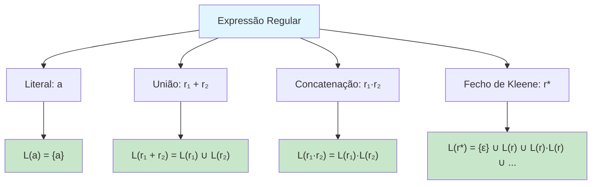
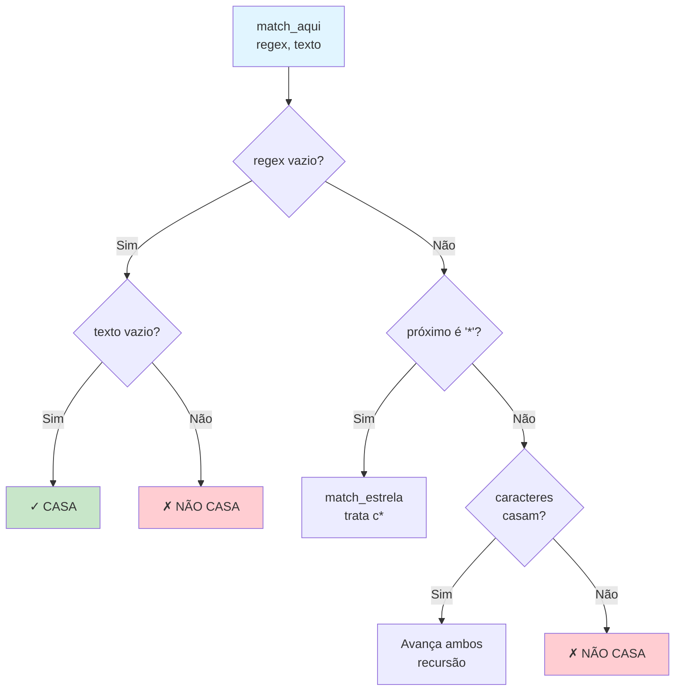
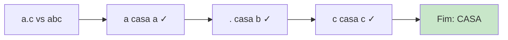
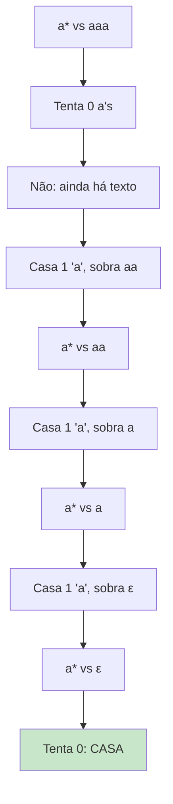
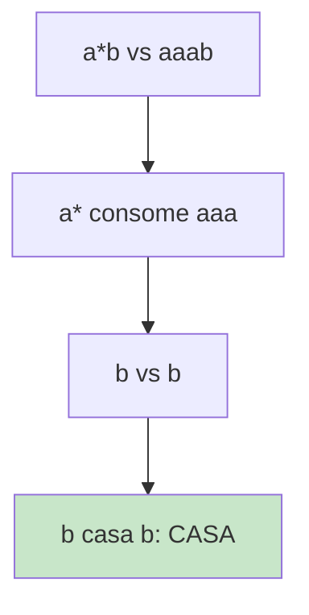
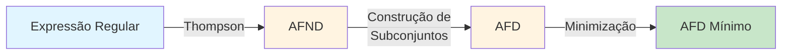
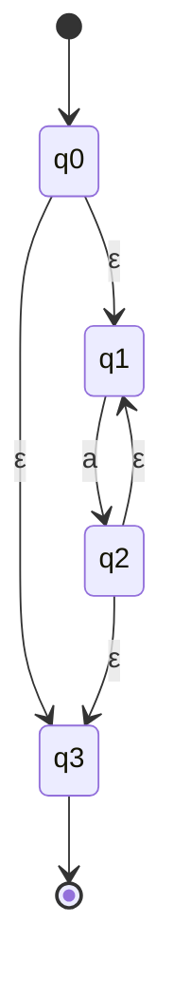
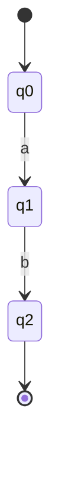
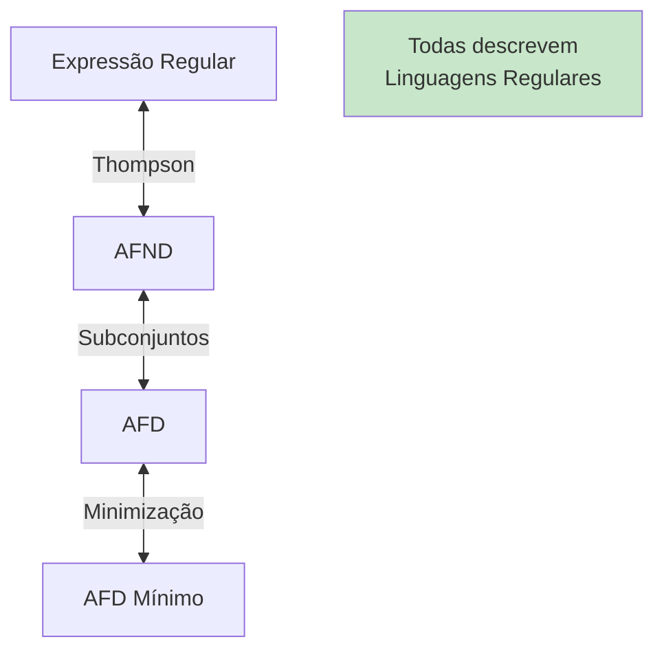

# Linguagens Regulares e Expressões Regulares

Este diretório contém implementação de um casador (matcher) de expressões regulares básicas.

## 📚 Conteúdo

- **regex_basico.c** - Implementação recursiva de casamento de expressões regulares

## 🎯 Objetivos de Aprendizado

- Entender a semântica de expressões regulares
- Conectar teoria com implementação
- Compreender os operadores básicos: literal, curinga e fecho de Kleene

---

## Expressões Regulares Básicas (regex_basico.c)

### O que são Expressões Regulares?

**Expressões Regulares (regex)** são padrões usados para descrever linguagens regulares de forma concisa e poderosa.

### Operadores Implementados

| Operador | Nome | Descrição | Exemplo |
|----------|------|-----------|---------|
| `c` | Literal | Casa exatamente o caractere c | `a` casa com "a" |
| `.` | Curinga | Casa qualquer caractere | `.` casa com "a", "b", "1", etc. |
| `c*` | Fecho de Kleene | Zero ou mais ocorrências de c | `a*` casa com "", "a", "aa", "aaa", ... |

### Operadores de Expressões Regulares (Teoria Completa)



### Como Funciona o Algoritmo

O código usa **recursão** para simular o não-determinismo de um AFND.



### Fecho de Kleene (c*)

O operador `*` é tratado especialmente porque pode casar com 0, 1, 2, ... ocorrências.

```
L(r*) = {ε} ∪ L(r)·L(r*)
```

**Estratégia**: Tenta duas opções:
1. Casar zero ocorrências (pular o c*)
2. Casar uma ou mais ocorrências (consumir um c e tentar c* novamente)

```mermaid
flowchart TD
    A["match_estrela<br/>c, resto_regex, texto"] --> B[Tenta 0 ocorrências:<br/>match_aqui resto_regex, texto]
    B --> C{Casou?}
    C -->|Sim| D[✓ Retorna sucesso]
    C -->|Não| E{texto[0] casa com c?}
    E -->|Sim| F[Avança texto,<br/>tenta c* novamente]
    E -->|Não| G[✗ Retorna falha]
    F --> A
    
    style A fill:#e1f5ff
    style D fill:#c8e6c9
    style G fill:#ffcdd2
```

### Exemplos de Casamento

#### Exemplo 1: `a.c` casa com `"abc"`



#### Exemplo 2: `a*` casa com `"aaa"`



#### Exemplo 3: `a*b` casa com `"aaab"`



### Relação com Autômatos

Cada expressão regular pode ser convertida em um AFND usando a **Construção de Thompson**:



### Construção de Thompson - Exemplos

#### Para `a*`:



#### Para `ab`:



### Equivalência com Linguagens Regulares

**Teorema de Kleene**: As seguintes são equivalentes:
1. Linguagens reconhecidas por AFD
2. Linguagens reconhecidas por AFND
3. Linguagens descritas por Expressões Regulares



### Para Executar

```bash
make bin/regex_basico
./bin/regex_basico
```

### Exemplo de Saída

```
Testando expressões regulares:

Regex: "a.c"  vs  "abc"  →  CASA ✓
Regex: "a.c"  vs  "adc"  →  CASA ✓
Regex: "a.c"  vs  "ac"   →  NÃO CASA ✗

Regex: "a*"   vs  "aaa"  →  CASA ✓
Regex: "a*"   vs  ""     →  CASA ✓
Regex: "a*"   vs  "b"    →  NÃO CASA ✗

Regex: "a*b"  vs  "aaab" →  CASA ✓
Regex: "a*b"  vs  "b"    →  CASA ✓
```

---

## 💡 Conceitos-chave

- **Recursão**: Simula o não-determinismo do AFND
- **Backtracking**: `c*` tenta múltiplas possibilidades
- **Composicionalidade**: Expressões complexas construídas a partir de simples
- **Casamento guloso**: `*` tenta consumir o máximo possível

## 🔗 Por que isso é importante?

Expressões regulares são usadas em:
- **Editores de texto**: Busca e substituição (vim, emacs, VSCode)
- **Compiladores**: Análise léxica (tokens)
- **Validação**: E-mails, URLs, números de telefone
- **Processamento de texto**: grep, sed, awk
- **Web scraping**: Extração de dados de HTML

## 📖 Aplicações Práticas

### Validação de E-mail (simplificado)
```
[a-z]+@[a-z]+\.[a-z]+
```

### Validação de Número de Telefone
```
\d{3}-\d{4}  ou  \d{5}-\d{4}
```

### Extração de URLs
```
https?://[^\s]+
```

## 🧮 Limitações das Expressões Regulares

Linguagens que **NÃO podem** ser descritas por regex:
- `{ aⁿbⁿ | n ≥ 0 }` - precisa contar a's e b's
- Parênteses balanceados - precisa de pilha
- Linguagens sensíveis ao contexto

Para essas, precisamos de:
- **Gramáticas Livre de Contexto** (GLC)
- **Autômatos com Pilha** (AP)
- **Máquinas de Turing** (MT)
