# Minimização e Conversão de Autômatos

Este diretório contém implementações de algoritmos importantes para transformar e otimizar autômatos.

## 📚 Conteúdo

- **conversao_afnd_afd.c** - Conversão de AFND para AFD (Construção de Subconjuntos)
- **minimizacao.c** - Minimização de AFD (Algoritmo de Preenchimento de Tabela)

## 🎯 Objetivos de Aprendizado

- Converter AFND em AFD equivalente
- Minimizar AFD removendo estados redundantes
- Entender equivalência de estados

---

## 1. Conversão AFND → AFD (conversao_afnd_afd.c)

### O que é a Construção de Subconjuntos?

A **Construção de Subconjuntos** (Subset Construction) é um algoritmo que converte qualquer AFND em um AFD equivalente.

**Ideia principal**: Cada estado do AFD representa um **conjunto de estados** do AFND.

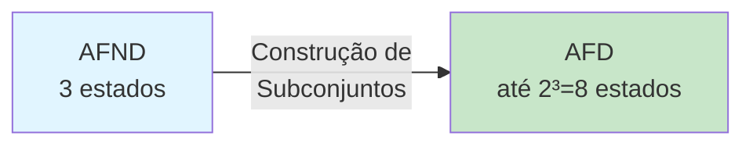

### Como Funciona

```mermaid
flowchart TD
    A[Inicia com {q₀}] --> B[Coloca na fila]
    B --> C{Fila vazia?}
    C -->|Não| D[Remove conjunto S da fila]
    D --> E[Para cada símbolo a]
    E --> F[Calcula δ'S,a' = união de δ'q,a'<br/>para todo q em S]
    F --> G{Conjunto novo?}
    G -->|Sim| H[Adiciona à fila<br/>Cria novo estado do AFD]
    G -->|Não| I[Apenas registra transição]
    H --> E
    I --> E
    E --> J{Mais símbolos?}
    J -->|Sim| E
    J -->|Não| C
    C -->|Sim| K[AFD Completo]
    
    style A fill:#e1f5ff
    style K fill:#c8e6c9
```

### Algoritmo Passo a Passo

#### 1. Estado Inicial
```
Estado inicial do AFD = {q₀} (estado inicial do AFND)
```

#### 2. Calcular Transições
Para cada conjunto S e símbolo a:
```
δ_AFD(S, a) = ⋃ δ_AFND(q, a)
              q∈S
```

#### 3. Estados de Aceitação
```
S é de aceitação no AFD ⟺ S ∩ F_AFND ≠ ∅
```

### Exemplo: AFND que reconhece cadeias contendo "ab"

#### AFND Original

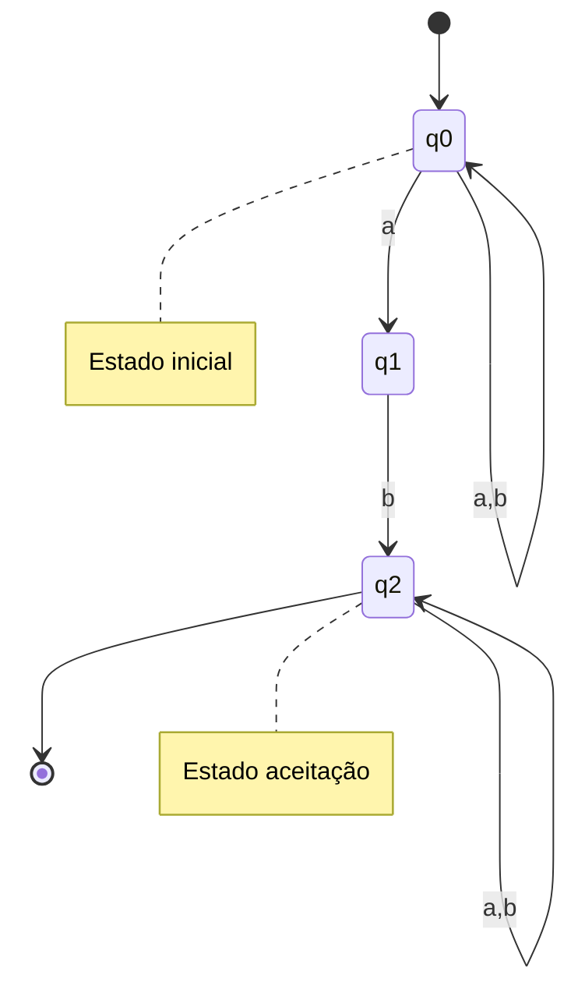

**Transições do AFND:**
```
δ(q0, a) = {q0, q1}
δ(q0, b) = {q0}
δ(q1, a) = ∅
δ(q1, b) = {q2}
δ(q2, a) = {q2}
δ(q2, b) = {q2}
```

#### Construção do AFD

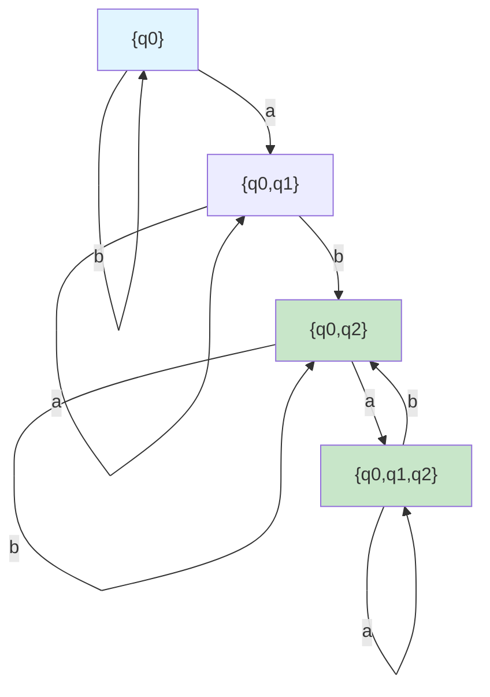

**Estados do AFD resultante:**
1. {q0} - inicial (não aceita)
2. {q0, q1} - não aceita
3. {q0, q2} - **aceita** (contém q2)
4. {q0, q1, q2} - **aceita** (contém q2)

### Complexidade

- **Pior caso**: O AFD pode ter 2^n estados (n = estados do AFND)
- **Prática**: Geralmente muito menor que 2^n
- **Tempo**: O(2^n × |Σ|) no pior caso

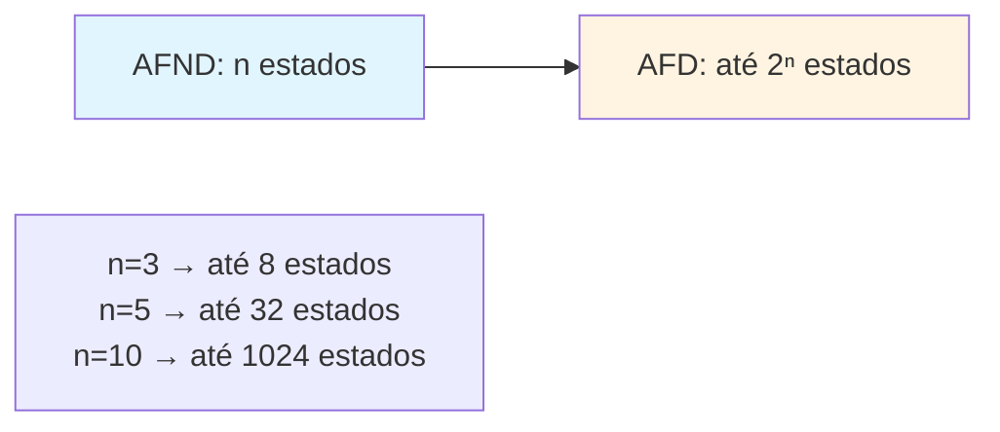

### Para Executar

```bash
make bin/conversao_afnd_afd
./bin/conversao_afnd_afd
```

---

## 2. Minimização de AFD (minimizacao.c)

### O que é Minimização?

**Minimização** é o processo de reduzir um AFD ao menor número possível de estados, mantendo a linguagem reconhecida.

**Objetivo**: Encontrar o **AFD mínimo** - aquele com o menor número de estados possível.

### Estados Equivalentes

Dois estados p e q são **equivalentes** se:
- Para toda palavra w, δ(p, w) aceita ⟺ δ(q, w) aceita
- Comportam-se da mesma forma para qualquer entrada futura

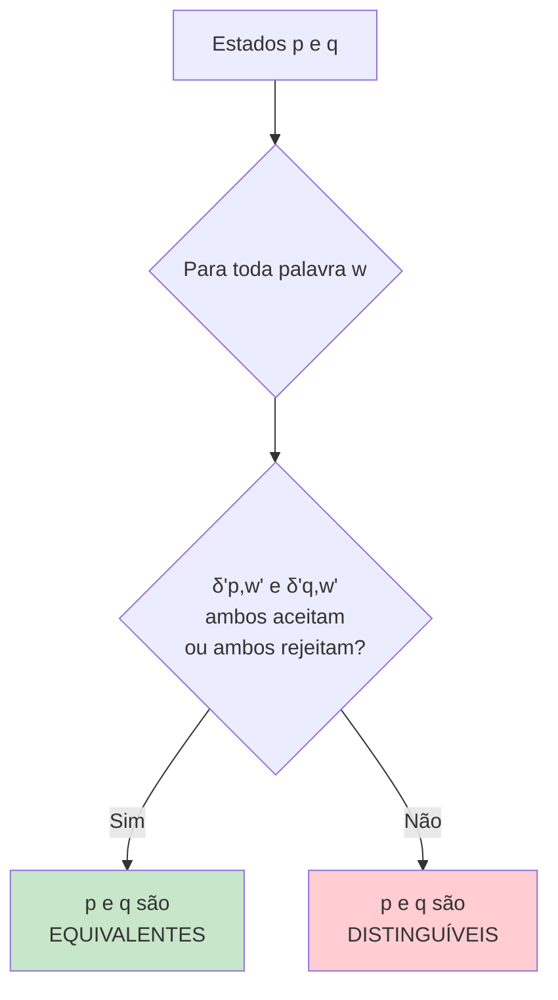

### Algoritmo de Preenchimento de Tabela

#### Passo 1: Remover Estados Inalcançáveis

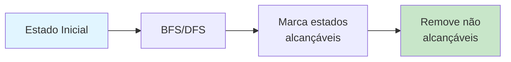

#### Passo 2: Marcar Pares Trivialmente Distinguíveis

Estados onde um aceita e outro rejeita são **obviamente distinguíveis**.

```
Se p ∈ F e q ∉ F, então (p,q) é distinguível
```

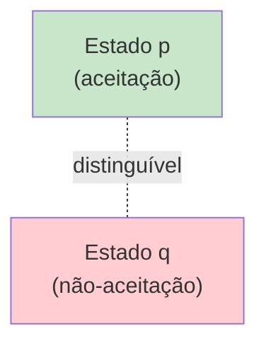

#### Passo 3: Propagar Distinguibilidade

Se δ(p,a) e δ(q,a) são distinguíveis, então p e q também são.

```mermaid
flowchart TD
    A["Para cada par (p,q)<br/>não marcado"] --> B["Para cada símbolo a"]
    B --> C["r = δ(p,a)<br/>s = δ(q,a)"]
    C --> D{(r,s) já está<br/>marcado?}
    D -->|Sim| E["Marca (p,q)<br/>como distinguível"]
    D -->|Não| F[Continua]
    E --> G{Alguma<br/>nova marcação?}
    F --> G
    G -->|Sim| A
    G -->|Não| H[Fim: pares não marcados<br/>são equivalentes]
    
    style A fill:#e1f5ff
    style H fill:#c8e6c9
```

#### Passo 4: Fundir Estados Equivalentes

Pares que **não foram marcados** são equivalentes e podem ser fundidos.

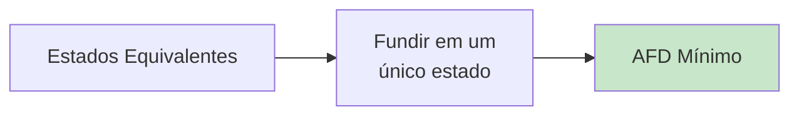

### Exemplo Completo

**AFD Original** (6 estados):

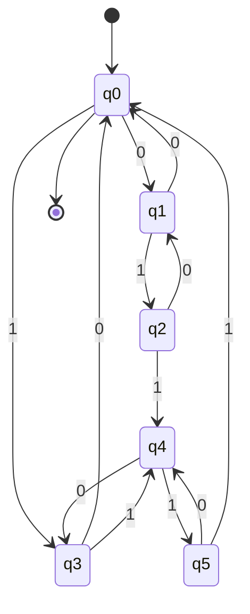

Reconhece: cadeias binárias com número **par** de 0's.

**Análise de Equivalência:**
- q0 ≡ q0 (trivial)
- q1 ≡ q3 (mesmo comportamento)
- q2 ≡ q4 (mesmo comportamento)
- q5 é único

**AFD Minimizado** (2 estados):

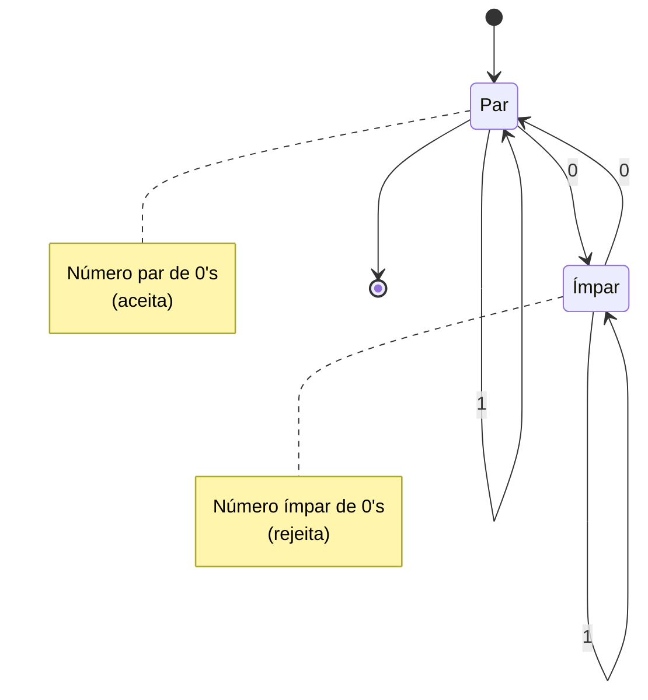

Redução: **6 estados → 2 estados**

### Matriz de Distinguibilidade

Tabela triangular para marcar pares distinguíveis:

```
     q0  q1  q2  q3  q4
q1   [ ]
q2   [X] [ ]
q3   [ ] [≡] [X]
q4   [X] [X] [≡] [X]
q5   [X] [X] [X] [X] [X]
```

- `[X]` = distinguível
- `[≡]` = equivalente (não marcado)
- `[ ]` = ainda não determinado

### Para Executar

```bash
make bin/minimizacao
./bin/minimizacao
```

---

## 🔗 Relacionamento entre os Algoritmos

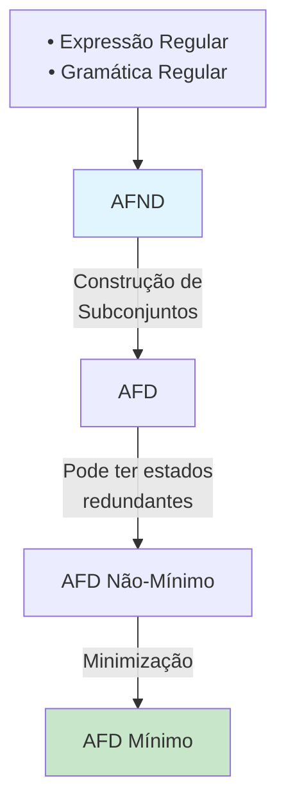

## 💡 Conceitos-chave

### Construção de Subconjuntos
- **Converte** AFND em AFD
- Estados do AFD = **conjuntos** de estados do AFND
- AFD resultante pode ser **grande** (até 2^n estados)
- **Sempre** produz um AFD equivalente

### Minimização
- **Otimiza** AFD removendo redundância
- Baseado em **equivalência** de estados
- AFD mínimo é **único** (a menos de renomeação)
- **Não muda** a linguagem reconhecida

## 🧮 Complexidade

| Operação | Complexidade Temporal | Complexidade Espacial |
|----------|----------------------|----------------------|
| AFND → AFD | O(2^n × \|Σ\|) | O(2^n) |
| Minimização | O(n² × \|Σ\|) | O(n²) |

onde n = número de estados do AFND

## 📖 Aplicações Práticas

- **Compiladores**: Minimizar tabelas de analisadores léxicos
- **Processamento de texto**: Otimizar motores de regex
- **Verificação formal**: Comparar autômatos (minimização canônica)
- **Hardware**: Reduzir circuitos de controle

## 🔍 Por que Minimizar?

1. **Eficiência**: Menos estados = menos memória, processamento mais rápido
2. **Comparação**: AFDs mínimos são únicos (isomorfos)
3. **Clareza**: Mais fácil de entender e analisar
4. **Custo**: Em hardware, cada estado tem um custo físico

## 🎯 Teorema de Myhill-Nerode

**Teorema**: Para toda linguagem regular L, existe um único (a menos de isomorfismo) AFD mínimo que reconhece L.

**Corolário**: Dois AFDs minimizados que reconhecem a mesma linguagem são isomorfos.

Isso permite **testar equivalência** de autômatos:
1. Minimizar ambos
2. Comparar estruturas
3. Se isomorfos → linguagens iguais
