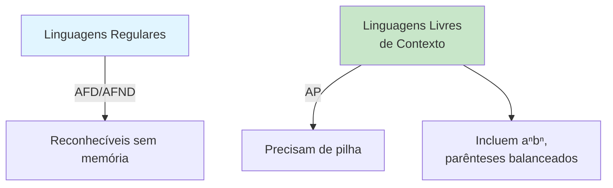
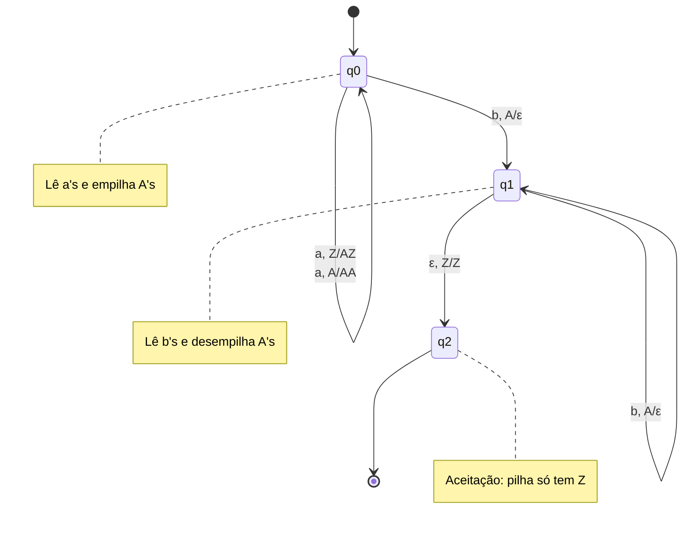
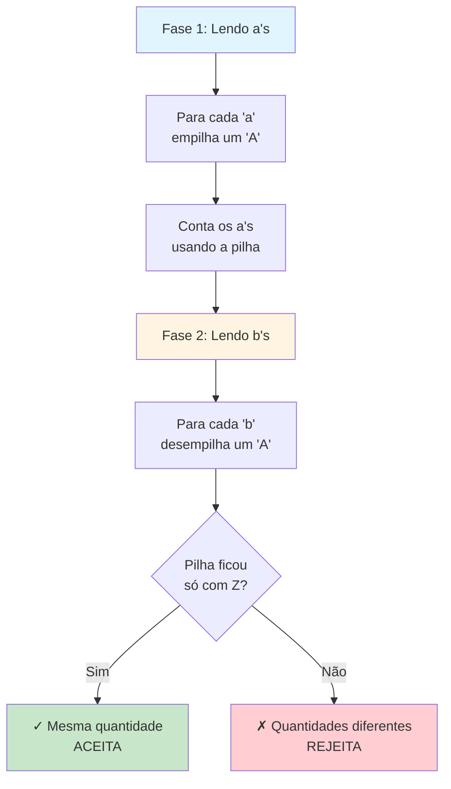
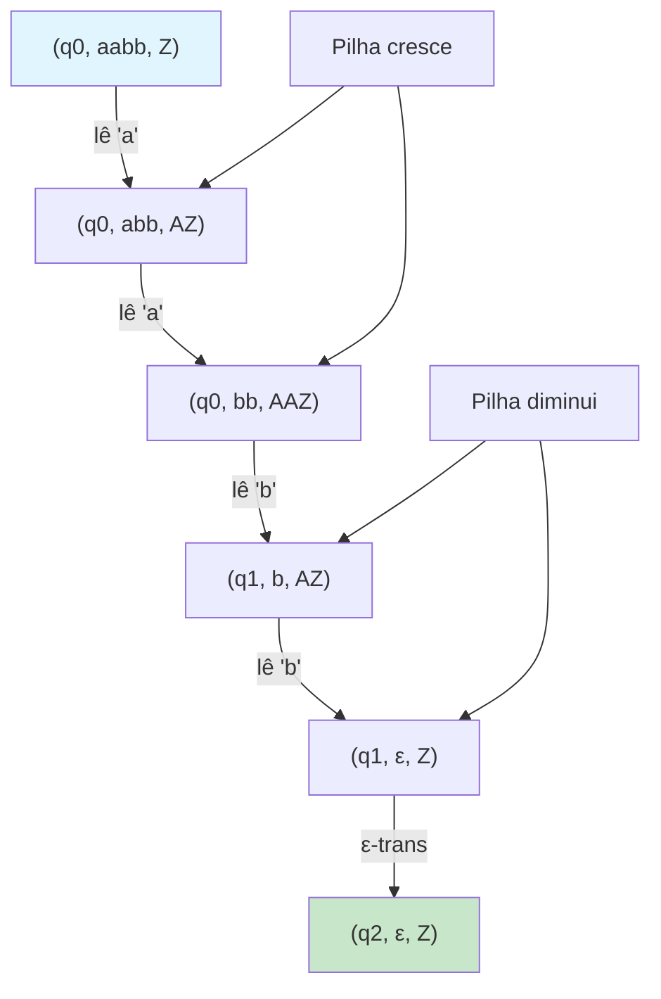
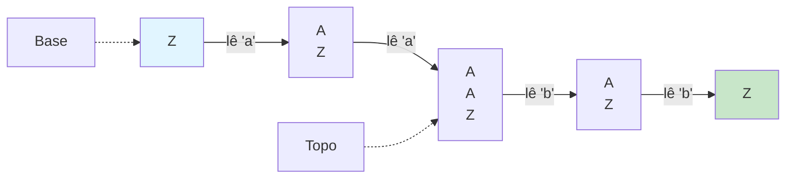
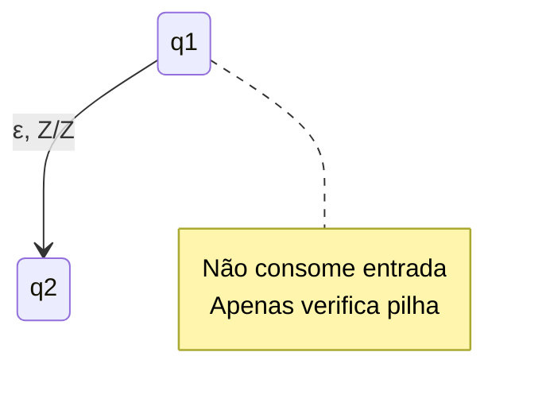
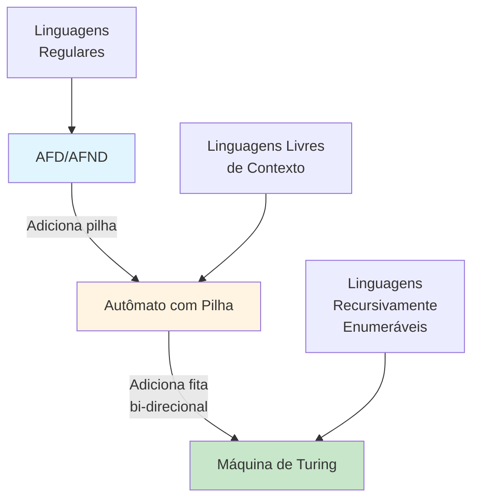
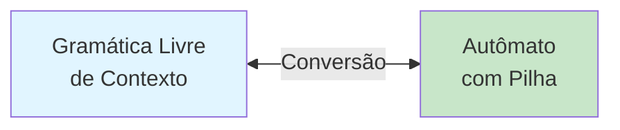
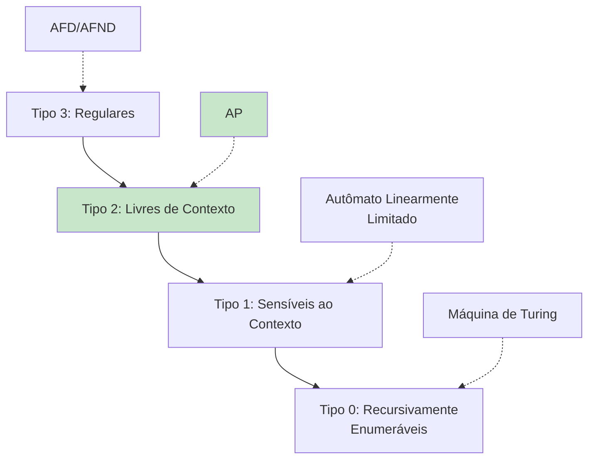

# Gramáticas Livres de Contexto e Autômatos com Pilha

Este diretório contém implementação de um Autômato com Pilha (Pushdown Automaton).

## 📚 Conteúdo

- **automato_pilha.c** - Autômato com Pilha que reconhece a^n b^n

## 🎯 Objetivos de Aprendizado

- Entender linguagens que vão além das regulares
- Compreender o papel da pilha na computação
- Simular autômatos com pilha

---

## Autômato com Pilha (automato_pilha.c)

### O que é um Autômato com Pilha?

Um **Autômato com Pilha (AP)** ou **Pushdown Automaton (PDA)** é uma extensão do autômato finito que possui uma **pilha** de memória auxiliar.

**Características**:
- Lê entrada símbolo por símbolo (como AFD/AFND)
- Tem acesso a uma **pilha** (LIFO - Last In, First Out)
- Pode empilhar (push) e desempilhar (pop) símbolos
- **Mais poderoso** que autômatos finitos

### Por que Precisamos de Pilha?

Autômatos finitos **NÃO conseguem** reconhecer linguagens como:
- `L = { aⁿbⁿ | n ≥ 1 }` = {ab, aabb, aaabbb, ...}
- Parênteses balanceados: (), (()), ((()))
- Palíndromos: aba, abba, abcba

**Motivo**: Precisam "contar" ou "lembrar" infinitas possibilidades.



### Definição Formal

```
M = (Q, Σ, Γ, δ, q₀, Z₀, F)

Q  = {q0, q1, q2}          Estados
Σ  = {a, b}                Alfabeto de entrada
Γ  = {A, Z}                Alfabeto da pilha
q₀ = q0                    Estado inicial
Z₀ = Z                     Símbolo inicial da pilha
F  = {q2}                  Estados de aceitação
δ  = função de transição   Q × (Σ ∪ {ε}) × Γ → P(Q × Γ*)
```

### Linguagem Reconhecida

```
L = { aⁿbⁿ | n ≥ 1 }
  = {ab, aabb, aaabbb, aaaabbbb, ...}
```

**Exemplos**:
- ✓ "ab" → ACEITA (1 a, 1 b)
- ✓ "aabb" → ACEITA (2 a's, 2 b's)
- ✓ "aaabbb" → ACEITA (3 a's, 3 b's)
- ✗ "aab" → REJEITA (2 a's, 1 b)
- ✗ "abb" → REJEITA (1 a, 2 b's)

### Diagrama de Estados e Transições



**Notação**: `símbolo_lido, topo_pilha/escreve_na_pilha`

### Como Funciona a Estratégia



### Tabela de Transições Detalhada

```
Estado  Lê  Topo   →  Novo Estado  Escreve
──────  ──  ────      ───────────  ───────
q0      a   Z     →   q0           AZ      (empilha A)
q0      a   A     →   q0           AA      (empilha A)
q0      b   A     →   q1           ε       (desempilha A)
q1      b   A     →   q1           ε       (desempilha A)
q1      ε   Z     →   q2           Z       (transição-ε)
```

### Exemplo de Execução: "aabb"



**Passo a passo**:

| Passo | Estado | Entrada Restante | Pilha | Ação |
|-------|--------|------------------|-------|------|
| 0 | q0 | aabb | Z | Inicial |
| 1 | q0 | abb | AZ | Lê 'a', empilha A |
| 2 | q0 | bb | AAZ | Lê 'a', empilha A |
| 3 | q1 | b | AZ | Lê 'b', desempilha A |
| 4 | q1 | ε | Z | Lê 'b', desempilha A |
| 5 | q2 | ε | Z | Transição-ε, **ACEITA** |

### Visualização da Pilha



### Configuração Instantânea

Uma **configuração** do AP é representada por:
```
(estado, entrada_restante, conteúdo_pilha)
```

**Exemplo**: `(q0, "abb", "AZ")`
- Estado atual: q0
- Ainda precisa ler: "abb"
- Pilha tem: A no topo, Z na base

### Transições-ε (Epsilon)

O AP pode fazer transições **sem consumir entrada**:
```
δ(q1, ε, Z) = {(q2, Z)}
```

Permite mudanças de estado baseadas apenas no estado e pilha.



### Para Executar

```bash
make bin/automato_pilha
./bin/automato_pilha
```

### Exemplo de Saída

```
Autômato com Pilha (AP)
L = { aⁿbⁿ | n >= 1 }

Palavra: "aabb"
  Configurações:
  (q0, aabb, Z)
  (q0, abb, AZ)
  (q0, bb, AAZ)
  (q1, b, AZ)
  (q1, ε, Z)
  (q2, ε, Z)
  Resultado: ACEITA ✓

Palavra: "aab"
  Configurações:
  (q0, aab, Z)
  (q0, ab, AZ)
  (q0, b, AAZ)
  (q1, ε, AZ)
  Estado final: q1 (não é aceitação)
  Resultado: REJEITA ✗
```

---

## 💡 Conceitos-chave

### Pilha (Stack)
- **LIFO**: Last In, First Out (último a entrar, primeiro a sair)
- **Push**: Adiciona elemento no topo
- **Pop**: Remove elemento do topo
- **Top**: Consulta elemento do topo sem remover

### Poder Computacional


### Determinismo vs Não-Determinismo

**AP Determinístico (APD)**:
- Para cada (estado, símbolo, topo), no máximo uma transição
- **Menos poderoso** que AP não-determinístico

**AP Não-Determinístico (APND)**:
- Pode ter múltiplas transições
- Equivalente em poder a **Gramáticas Livres de Contexto**

```
Linguagens reconhecidas por APD ⊂ Linguagens reconhecidas por APND = GLC
```

## 🔗 Relação com Gramáticas

Todo Autômato com Pilha corresponde a uma **Gramática Livre de Contexto**:

**Gramática para aⁿbⁿ**:
```
S → aSb | ab
```

**Derivação de "aabb"**:
```
S ⇒ aSb
  ⇒ aaSbb
  ⇒ aabbb
```



## 📖 Aplicações Práticas

### Análise Sintática
Compiladores usam AP para verificar sintaxe:
```c
if (x > 0) {
    y = x + 1;
}
```

A pilha rastreia:
- Parênteses abertos/fechados
- Blocos aninhados
- Estruturas de controle

### Avaliação de Expressões
```
3 + (5 * 2)
```

Pilha mantém operadores e operandos.

### Validação de XML/HTML
```xml
<html>
  <body>
    <div>Conteúdo</div>
  </body>
</html>
```

Pilha rastreia tags abertas.

## 🧮 Limitações dos AP

Linguagens que **NÃO** podem ser reconhecidas por AP:
- `{ aⁿbⁿcⁿ | n ≥ 0 }` - precisa de duas pilhas
- `{ ww | w ∈ {a,b}* }` - palíndromos pares
- Linguagens sensíveis ao contexto

Para essas, precisamos de **Máquinas de Turing**.

## 🎯 Hierarquia de Chomsky



**AP reconhecem exatamente as Linguagens Livres de Contexto (Tipo 2)**
