# Árvore de Derivação e Ambiguidade

Este diretório contém implementação de árvores de derivação para gramáticas livres de contexto.

## 📚 Conteúdo

- **arvore_derivacao.c** - Construção e visualização de árvores de derivação

## 🎯 Objetivos de Aprendizado

- Compreender derivações em gramáticas
- Visualizar árvores de derivação
- Entender o conceito de ambiguidade

---

## Árvore de Derivação (arvore_derivacao.c)

### O que é uma Árvore de Derivação?

Uma **Árvore de Derivação** (Parse Tree) é uma representação visual de como uma palavra é gerada a partir de uma gramática livre de contexto.

**Componentes**:
- **Raiz**: Símbolo inicial da gramática (S)
- **Nós internos**: Variáveis (não-terminais)
- **Folhas**: Símbolos terminais
- **Filhos**: Lado direito de uma regra de produção

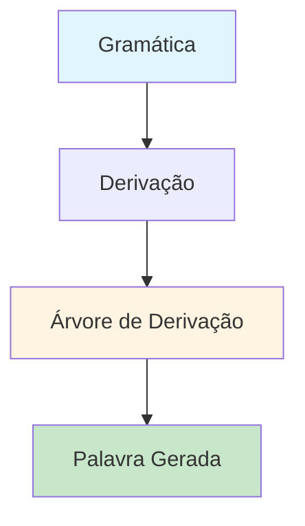

### Gramática Exemplo

```
S → aSb | ab
```

**Linguagem gerada**: L = { aⁿbⁿ | n ≥ 1 } = {ab, aabb, aaabbb, ...}

**Regras**:
1. `S → aSb` - Recursão: adiciona 'a' à esquerda e 'b' à direita
2. `S → ab` - Caso base: produção terminal

### Árvore de Derivação para "aabb"

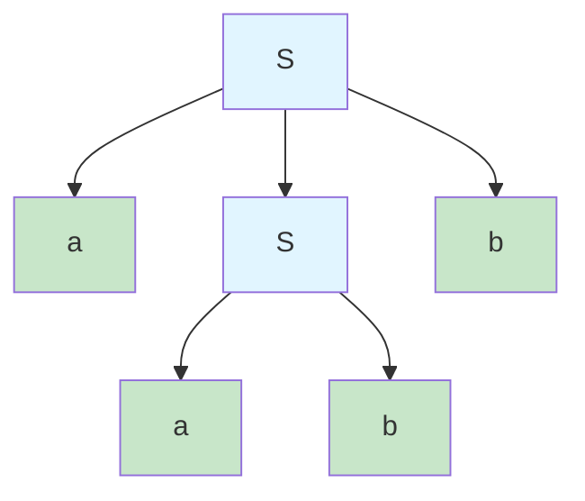

**Leitura das folhas** (da esquerda para a direita): a, a, b, b = "aabb" ✓

### Derivação Passo a Passo

**Derivação à esquerda** (leftmost derivation):

```
S ⇒ aSb         (aplica S → aSb)
  ⇒ aaSbb       (aplica S → aSb no S da esquerda)
  ⇒ aabbb       (aplica S → ab)
```

Resultado: **"aabb"**

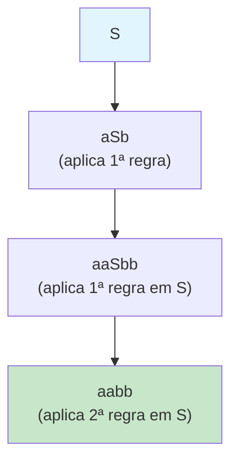

### Árvore de Derivação para "aaabbb"

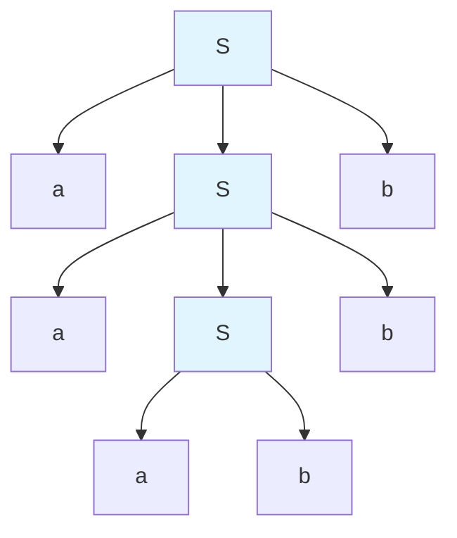

**Fronteira** (yield): a, a, a, b, b, b = "aaabbb" ✓

### Estrutura de Nó da Árvore

```c
typedef struct No {
    char simbolo[16];           // Símbolo (terminal ou não-terminal)
    struct No *filhos[MAX_FILHOS];  // Ponteiros para filhos
    int num_filhos;             // Quantidade de filhos
} No;
```

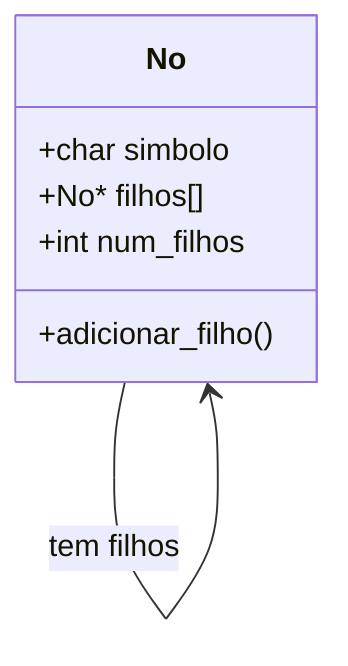

### Como Construir a Árvore

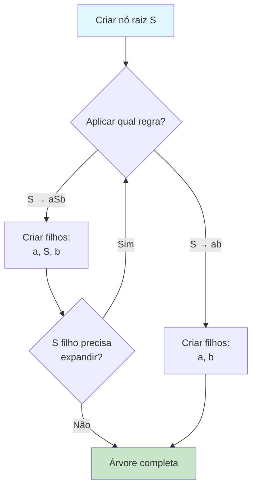

### Impressão da Árvore

O código imprime a árvore com indentação visual:

```
S
├── a
├── S
│   ├── a
│   ├── b
├── b
```

### Fronteira (Yield) da Árvore

A **fronteira** é a concatenação das folhas da esquerda para a direita.

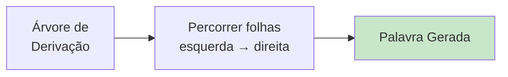

**Algoritmo**:
1. Se nó é folha (terminal), imprime símbolo
2. Senão, percorre filhos recursivamente da esquerda para direita

### Para Executar

```bash
make bin/arvore_derivacao
./bin/arvore_derivacao
```

### Exemplo de Saída

```
Árvore de Derivação para "aabb"
═══════════════════════════════

S
├── a
├── S
│   ├── a
│   ├── b
├── b

Derivação: aabb

━━━━━━━━━━━━━━━━━━━━━━━━━━━━━

Árvore de Derivação para "aaabbb"
══════════════════════════════════

S
├── a
├── S
│   ├── a
│   ├── S
│   │   ├── a
│   │   ├── b
│   ├── b
├── b

Derivação: aaabbb
```

---

## 🔄 Tipos de Derivação

### Derivação à Esquerda (Leftmost)

Sempre expande o **não-terminal mais à esquerda** primeiro.

```
S ⇒ aSb ⇒ aaSbb ⇒ aabb
     ^       ^        ^
```

### Derivação à Direita (Rightmost)

Sempre expande o **não-terminal mais à direita** primeiro.

```
S ⇒ aSb ⇒ aaSbb ⇒ aabb
         ^    ^      ^
```

**Importante**: Derivações diferentes podem produzir a **mesma árvore**.

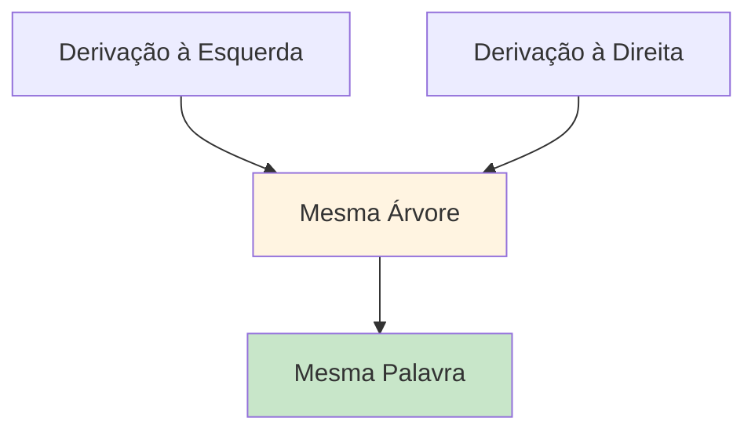

---

## ⚠️ Ambiguidade

### O que é Ambiguidade?

Uma gramática é **ambígua** se existe uma palavra que pode ser gerada por **duas ou mais árvores de derivação diferentes**.

### Exemplo: Gramática Ambígua

```
E → E + E | E * E | (E) | id
```

Para a expressão `id + id * id`:

#### Árvore 1: (id + id) * id

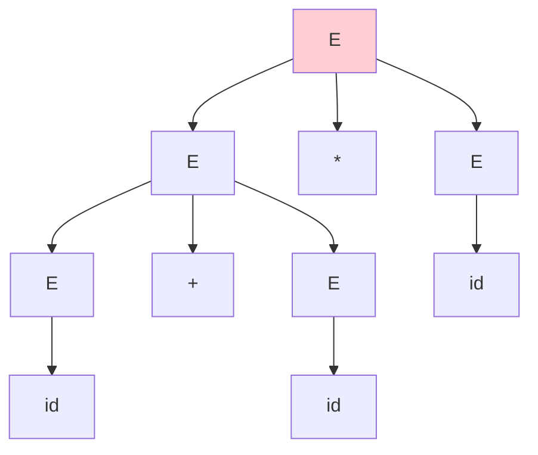

Resultado: (id + id) * id = **precedência errada!**

#### Árvore 2: id + (id * id)

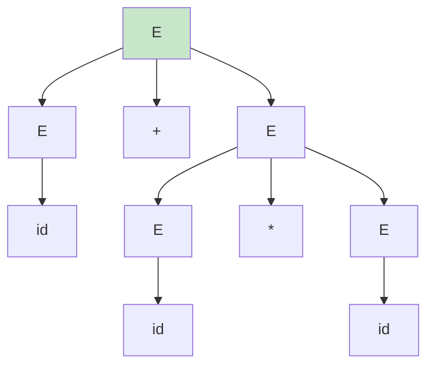

Resultado: id + (id * id) = **precedência correta!**

### Problema da Ambiguidade

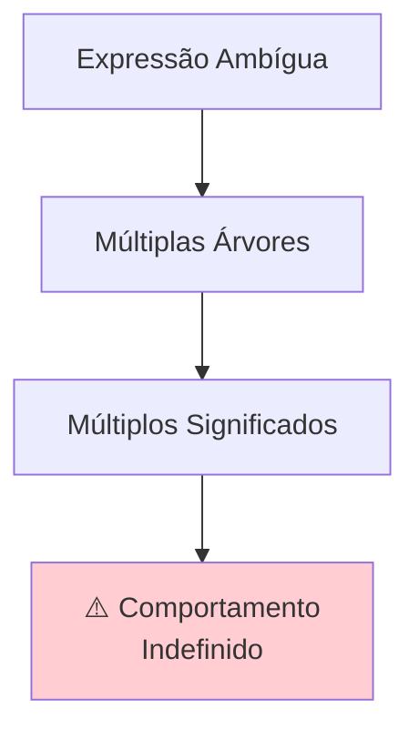

**Em compiladores**: Ambiguidade leva a resultados imprevisíveis!

### Soluções para Ambiguidade

#### 1. Reescrever a Gramática

Adicionar níveis de precedência:

```
E  → E + T | T
T  → T * F | F
F  → (E) | id
```

Agora `*` tem maior precedência que `+`.

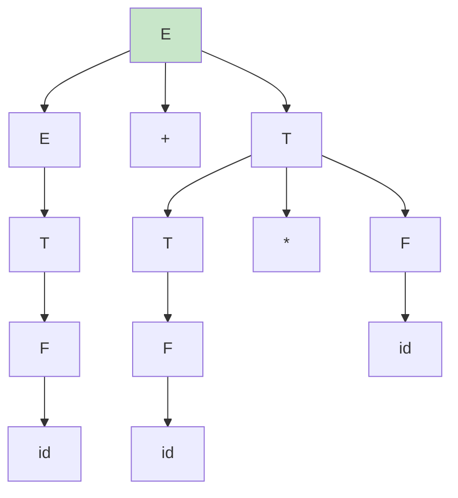

**Única árvore possível** → Não-ambígua!

#### 2. Adicionar Regras de Precedência

Manter gramática ambígua, mas adicionar regras externas:
- `*` tem precedência sobre `+`
- Associatividade à esquerda

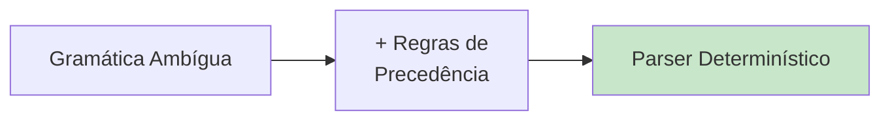

### Teste de Ambiguidade

**Não existe** algoritmo geral para determinar se uma gramática é ambígua!

**Na prática**:
- Procurar exemplos de palavras com múltiplas derivações
- Usar ferramentas de análise sintática (Bison, ANTLR)
- Testar casos problemáticos (operadores, recursão)

---

## 💡 Conceitos-chave

### Árvore de Derivação
- **Representa** como uma palavra é gerada
- **Raiz**: Símbolo inicial
- **Folhas**: Palavra gerada (terminais)
- **Estrutura**: Mostra aplicação das regras

### Derivação
- **Sequência de substituições** de variáveis
- **À esquerda**: Expande sempre a variável mais à esquerda
- **À direita**: Expande sempre a variável mais à direita
- **Derivações diferentes** podem dar mesma árvore

### Ambiguidade
- **Múltiplas árvores** para mesma palavra
- **Problema** em compiladores e interpretadores
- **Solução**: Reescrever gramática ou adicionar regras

## 🔗 Aplicações Práticas

### Compiladores
```
Código Fonte → Árvore Sintática → Código Intermediário
```

A árvore de derivação é a base para:
- **Análise sintática**
- **Verificação de tipos**
- **Geração de código**

### Linguagens de Programação

```c
if (x > 0) {
    y = x + 1;
}
```

Parser cria árvore:
```
if
├── condição: x > 0
└── bloco
    └── atribuição: y = x + 1
```

### Processamento de Linguagem Natural

```
"O gato bebeu o leite"
```

Árvore sintática:
```
Sentença
├── Sujeito: O gato
└── Predicado
    ├── Verbo: bebeu
    └── Objeto: o leite
```

## 📖 Relação com Outras Estruturas

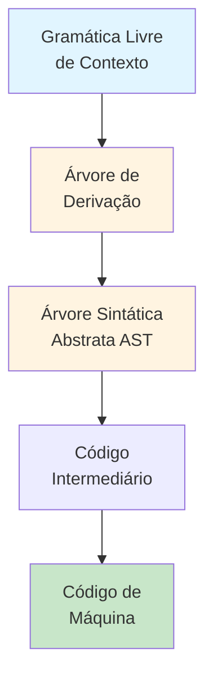

**AST (Abstract Syntax Tree)**: Versão simplificada da árvore de derivação, removendo detalhes sintáticos desnecessários.

## 🎯 Importância

- **Fundamento** da análise sintática
- **Visualização** de estruturas gramaticais
- **Detecção** de ambiguidade
- **Base** para otimizações em compiladores
