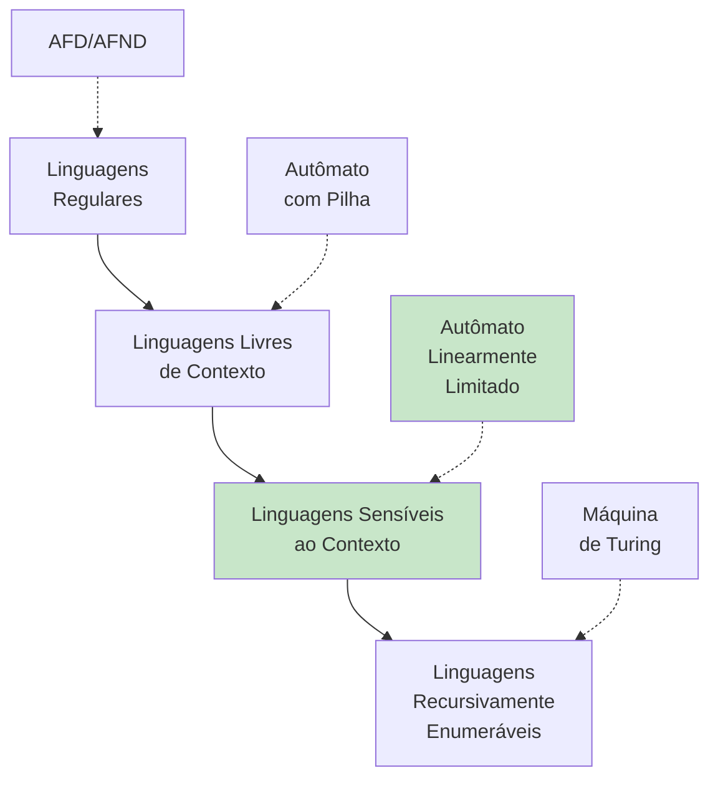
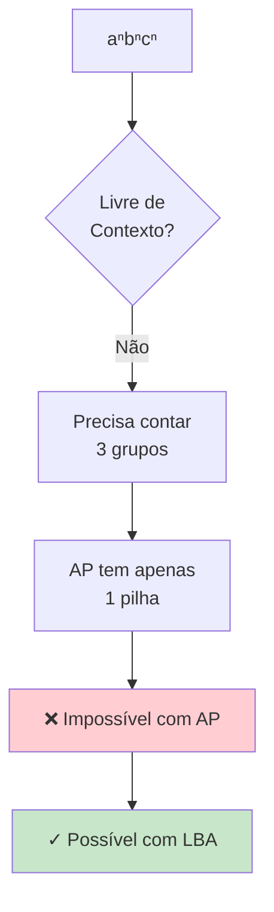
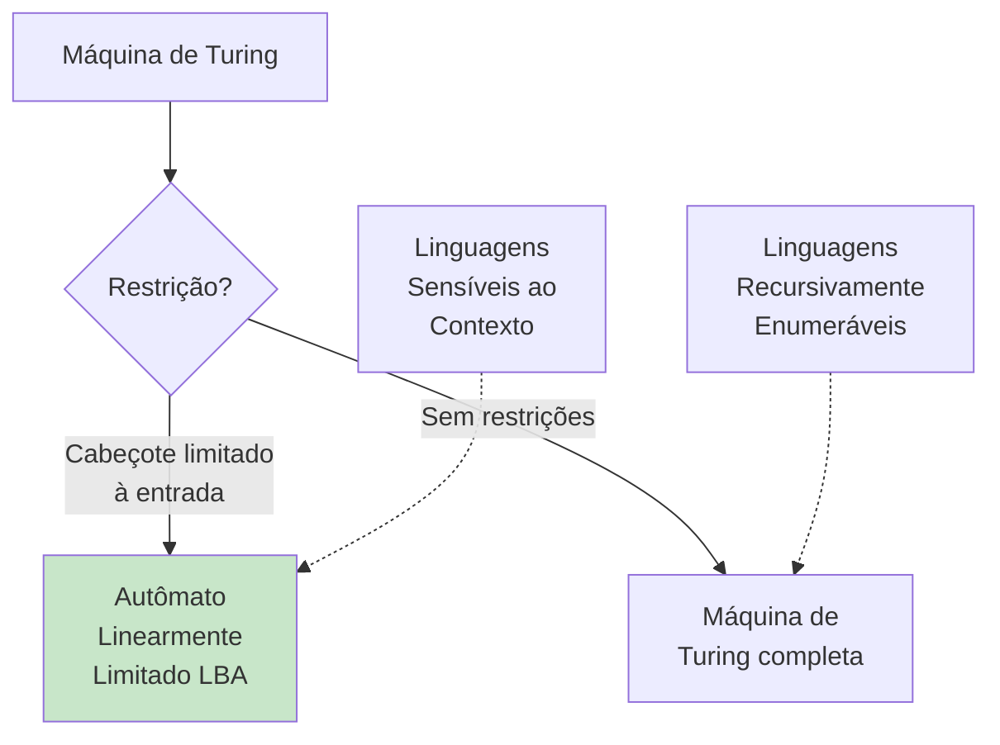
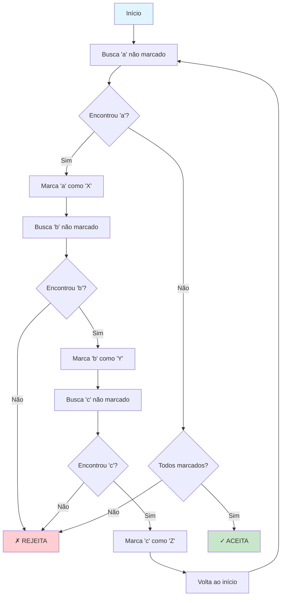
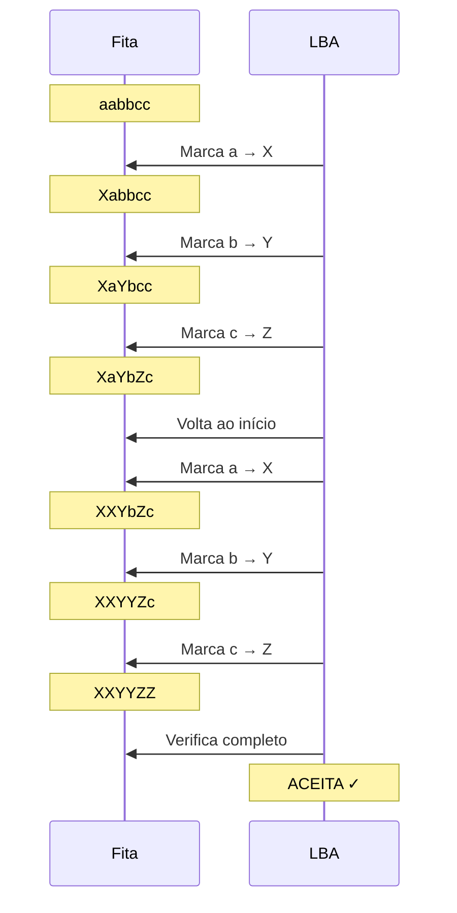
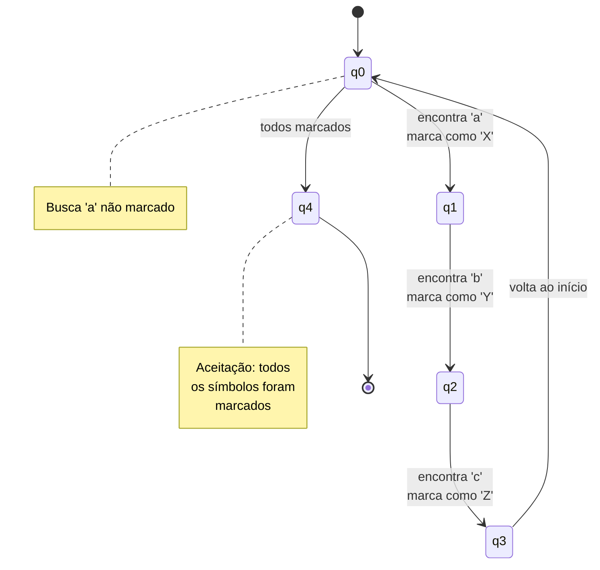
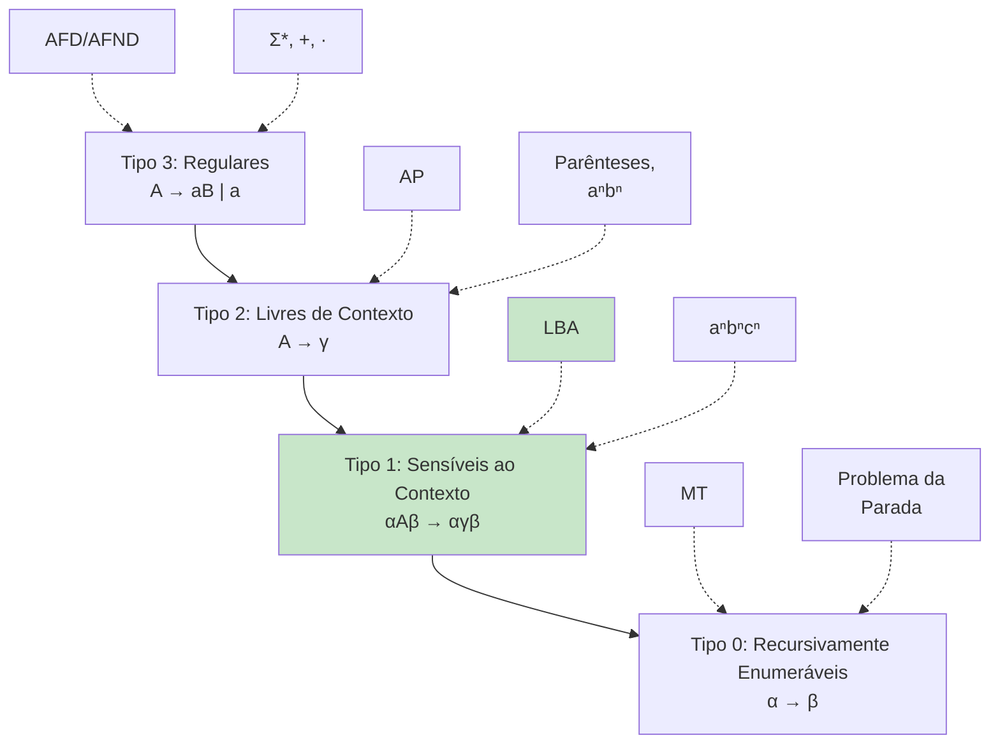

# Gramáticas Sensíveis ao Contexto

Este diretório contém implementação de um Autômato Linearmente Limitado (LBA) que reconhece linguagens sensíveis ao contexto.

## 📚 Conteúdo

- **gramatica_sensivel.c** - LBA que reconhece aⁿbⁿcⁿ

## 🎯 Objetivos de Aprendizado

- Entender linguagens sensíveis ao contexto
- Compreender Autômatos Linearmente Limitados
- Reconhecer limitações de linguagens livres de contexto

---

## Gramáticas Sensíveis ao Contexto (gramatica_sensivel.c)

### O que são Linguagens Sensíveis ao Contexto?

**Linguagens Sensíveis ao Contexto (LSC)** são mais poderosas que linguagens livres de contexto, mas menos que linguagens recursivamente enumeráveis.

**Características**:
- Regras podem depender do **contexto** ao redor
- Reconhecidas por **Autômatos Linearmente Limitados (LBA)**
- Sempre **decidíveis** (sempre param)



### Linguagem Exemplo: aⁿbⁿcⁿ

```
L = { aⁿbⁿcⁿ | n ≥ 1 }
  = {abc, aabbcc, aaabbbccc, ...}
```

**Por que não é livre de contexto?**
- Precisa contar **três** grupos independentes
- Autômato com Pilha tem apenas **uma pilha**
- Não consegue "lembrar" de dois contadores simultaneamente



### Gramática Sensível ao Contexto

```
S  → aSBC | aBC
CB → BC
aB → ab
bB → bb
bC → bc
cC → cc
```

**Observação**: A regra `CB → BC` depende do **contexto** (C seguido de B).

#### Derivação de "aabbcc"

```
S ⇒ aSBC
  ⇒ aaBCBC
  ⇒ aaBBCC    (aplica CB → BC)
  ⇒ aabBCC    (aplica aB → ab)
  ⇒ aabbCC    (aplica bB → bb)
  ⇒ aabbcC    (aplica bC → bc)
  ⇒ aabbcc    (aplica cC → cc)
```

### Autômato Linearmente Limitado (LBA)

Um **LBA** é uma Máquina de Turing com uma restrição:
- O cabeçote **não pode sair** dos limites da entrada
- Espaço disponível: O(n), onde n = tamanho da entrada
- **Linearmente limitado** ao tamanho da entrada



### Algoritmo de Marcação para aⁿbⁿcⁿ

**Estratégia**: Marcar um 'a', um 'b' e um 'c' por vez, verificando se sobraram símbolos não marcados.



### Exemplo de Execução: "aabbcc"

| Passo | Fita | Descrição |
|-------|------|-----------|
| 0 | [aabbcc] | Inicial |
| 1 | [Xabbcc] | Marca primeiro 'a' |
| 2 | [XaYbcc] | Marca primeiro 'b' |
| 3 | [XaYbZc] | Marca primeiro 'c' |
| 4 | [XaYbZc] | Volta ao início |
| 5 | [XXYbZc] | Marca segundo 'a' |
| 6 | [XXYYZc] | Marca segundo 'b' |
| 7 | [XXYYZZ] | Marca segundo 'c' |
| 8 | [XXYYZZ] | Verifica: todos marcados |
| 9 | - | **ACEITA** ✓ |



### Estados do LBA

```
q0 - busca próximo 'a' não marcado
q1 - encontrou 'a', busca 'b'
q2 - encontrou 'b', busca 'c'
q3 - encontrou 'c', volta ao início
q4 - estado de aceitação
```



### Para Executar

```bash
make bin/gramatica_sensivel
./bin/gramatica_sensivel
```

### Exemplo de Saída

```
Autômato Linearmente Limitado (LBA)
L = { aⁿbⁿcⁿ | n >= 1 }

Palavra: "aabbcc"
    [aabbcc]  pos=0
    [Xabbcc]  pos=1  marca 'a'
    [XaYbcc]  pos=3  marca 'b'
    [XaYbZc]  pos=5  marca 'c'
    [XaYbZc]  pos=0  volta ao início
    [XXYbZc]  pos=2  marca 'a'
    [XXYYZc]  pos=4  marca 'b'
    [XXYYZZ]  pos=6  marca 'c'
    Resultado: ACEITA ✓

Palavra: "aabcc"
    [aabcc]   pos=0
    [Xabcc]   pos=1  marca 'a'
    [XaYcc]   pos=3  marca 'b'
    [XaYcZ]   pos=5  marca 'c'
    [XaYcZ]   pos=0  volta ao início
    [XXYcZ]   pos=2  marca 'a'
    [XXYcZ]   pos=3  não encontrou 'b'
    Resultado: REJEITA ✗
```

---

## 💡 Conceitos-chave

### Linguagens Sensíveis ao Contexto
- **Regras dependem** do contexto ao redor
- **Mais poderosas** que livres de contexto
- **Sempre decidíveis** (sempre param)
- **Espaço linear** ao tamanho da entrada

### Autômato Linearmente Limitado
- Máquina de Turing **restrita**
- Cabeçote **não pode sair** dos limites da entrada
- Espaço: **O(n)** onde n = tamanho da entrada
- Reconhece exatamente as LSC

### Forma Normal de Kuroda

Regras de gramáticas sensíveis ao contexto:
```
αAβ → αγβ
```

Onde:
- A é um não-terminal
- α, β são contextos
- γ é não-vazio
- |α| + |γ| + |β| ≥ |α| + |A| + |β|

**Restrição**: Produções **não diminuem** o comprimento da forma sentencial.

## 🔗 Hierarquia de Chomsky Completa



## 📖 Exemplos de Linguagens

### Tipo 3 (Regulares)
- `(a|b)*`
- Números pares
- Identificadores

### Tipo 2 (Livres de Contexto)
- `{ aⁿbⁿ | n ≥ 0 }`
- Parênteses balanceados
- Expressões aritméticas

### Tipo 1 (Sensíveis ao Contexto)
- `{ aⁿbⁿcⁿ | n ≥ 1 }`
- `{ ww | w ∈ {a,b}* }` (duplicação)
- Linguagens com múltiplas dependências

### Tipo 0 (Recursivamente Enumeráveis)
- Problema da Parada
- Teorema de Gödel
- Funções parciais computáveis

## 🧮 Propriedades

| Propriedade | LSC |
|-------------|-----|
| Decidibilidade | **Sempre decidível** |
| Problema da Pertinência | **Decidível** (mas PSPACE-completo) |
| Fechamento sob União | ✓ Sim |
| Fechamento sob Concatenação | ✓ Sim |
| Fechamento sob Fecho de Kleene | ✓ Sim |
| Fechamento sob Complemento | ✓ Sim |
| Fechamento sob Interseção | ✓ Sim |

## 🔍 Por que é importante?

### Compiladores
Algumas verificações semânticas são sensíveis ao contexto:
- Declaração antes do uso
- Tipos compatíveis em atribuições
- Escopo de variáveis

### Linguagens Naturais
Muitas regras gramaticais dependem do contexto:
- Concordância nominal
- Concordância verbal
- Referências anafóricas

### Bioinformática
Padrões em DNA/RNA podem ter dependências múltiplas.

## ⚠️ Complexidade

- **Problema da Pertinência**: PSPACE-completo
- Muito mais **difícil** que linguagens livres de contexto
- Geralmente **impraticável** para aplicações reais
- Compiladores usam **aproximações** (verificação em fases)
