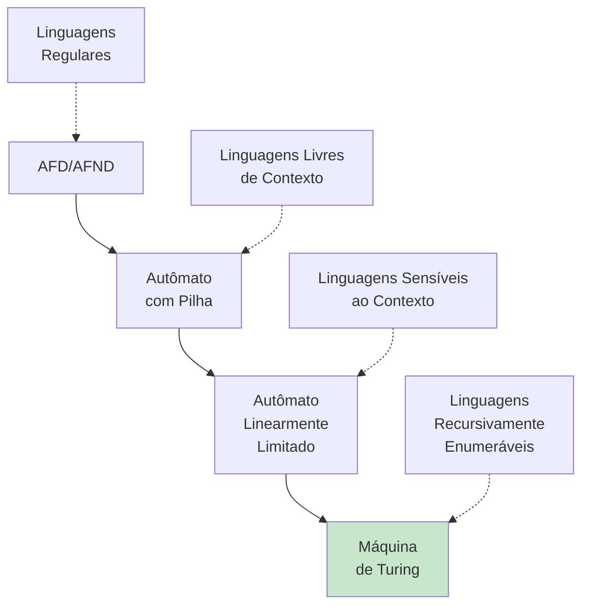
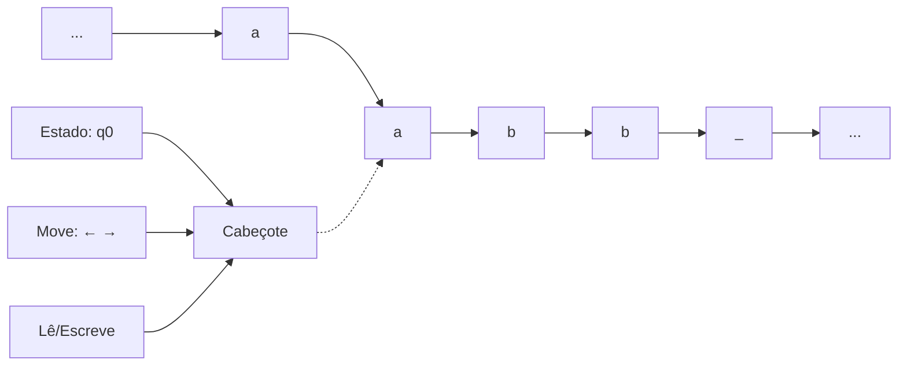
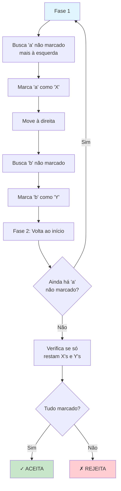
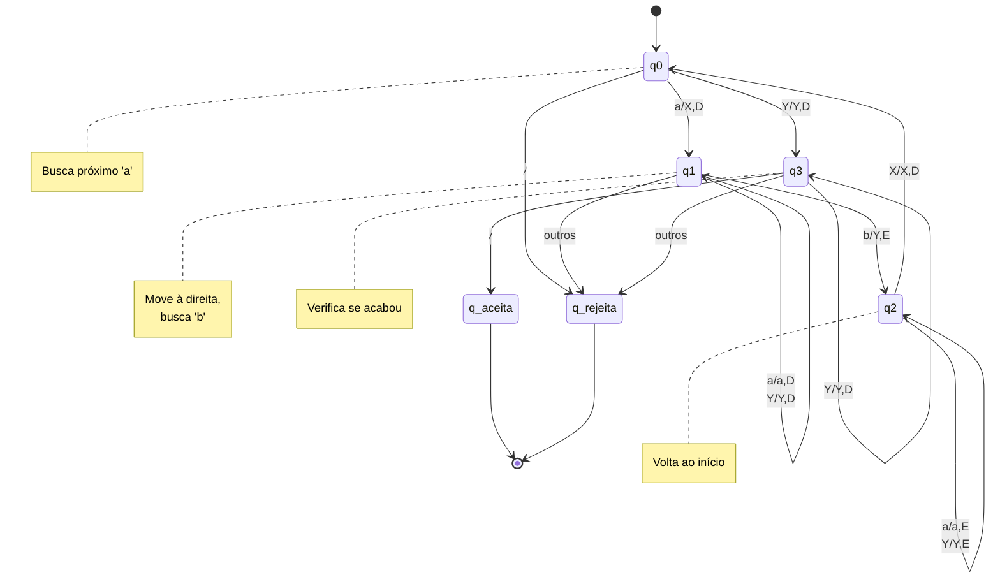
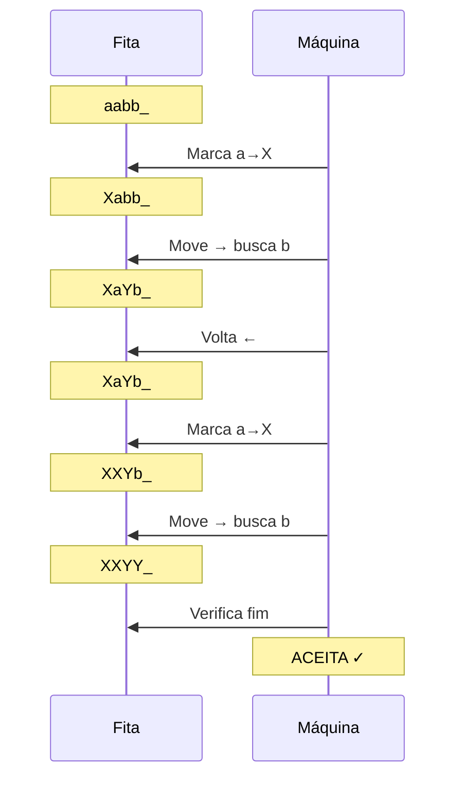
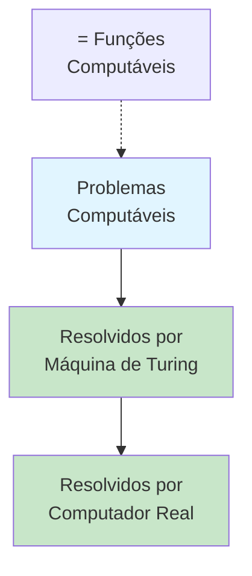
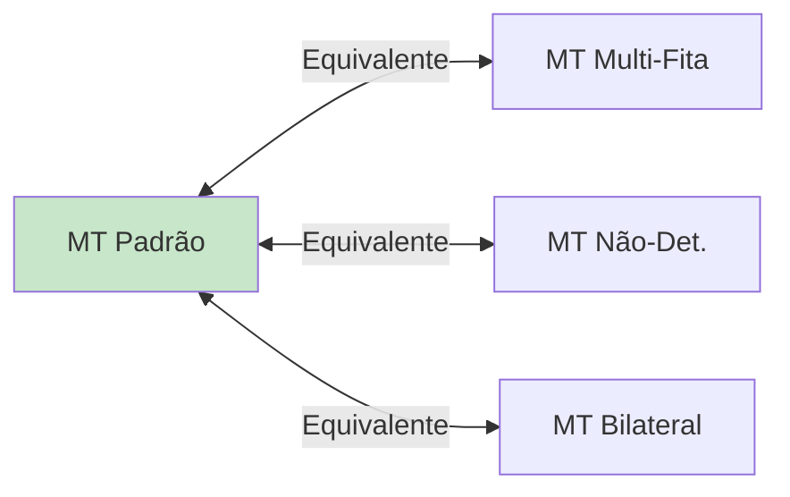
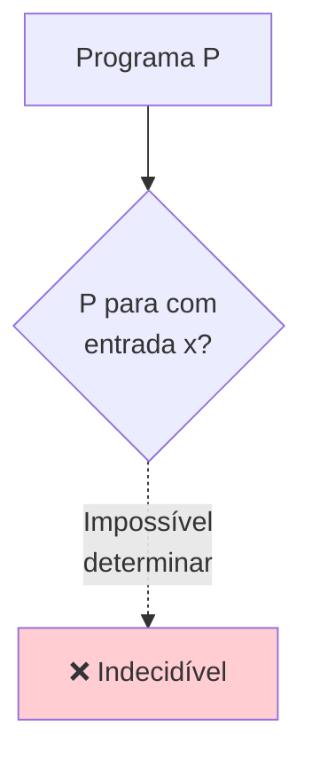
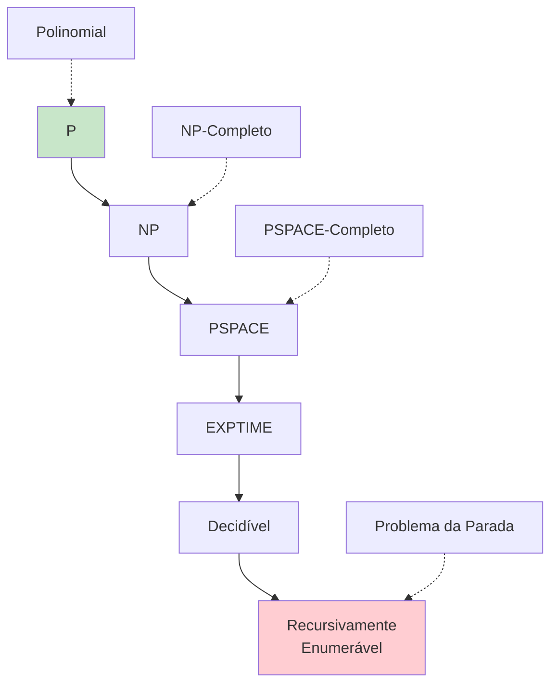
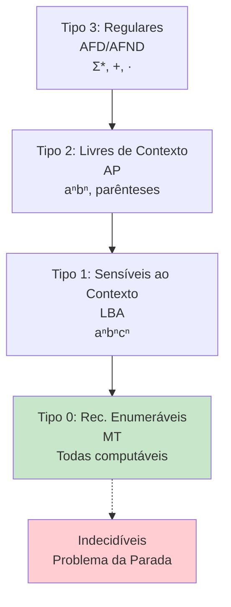

# Máquina de Turing

Este diretório contém implementação de uma Máquina de Turing que reconhece aⁿbⁿ.

## 📚 Conteúdo

- **maquina_turing.c** - Máquina de Turing que reconhece { aⁿbⁿ | n ≥ 1 }

## 🎯 Objetivos de Aprendizado

- Compreender o modelo computacional universal
- Entender o funcionamento de uma Máquina de Turing
- Simular computação com fita infinita

---

## Máquina de Turing (maquina_turing.c)

### O que é uma Máquina de Turing?

A **Máquina de Turing (MT)** é o modelo computacional mais poderoso conhecido. Foi proposta por Alan Turing em 1936 e é a base teórica para todos os computadores modernos.

**Características**:
- **Fita infinita** (memória ilimitada)
- **Cabeçote** que lê e escreve na fita
- Move-se **para esquerda ou direita**
- Pode **reescrever** símbolos na fita
- Mais poderosa que todos os modelos anteriores



### Definição Formal

```
M = (Q, Σ, Γ, δ, q₀, q_aceita, q_rejeita)

Q          = {q0, q1, q2, q3, q_aceita, q_rejeita}
Σ          = {a, b}           Alfabeto de entrada
Γ          = {a, b, X, Y, _}  Alfabeto da fita
q₀         = q0               Estado inicial
q_aceita   = estado de aceitação
q_rejeita  = estado de rejeição
δ          = Q × Γ → Q × Γ × {L, R}  Função de transição
```

**Símbolo branco**: `_` (representa células vazias da fita)

### Linguagem Reconhecida

```
L = { aⁿbⁿ | n ≥ 1 }
  = {ab, aabb, aaabbb, aaaabbbb, ...}
```

**Mesma linguagem** que o Autômato com Pilha, mas implementação diferente!

### Visualização da Máquina de Turing



### Algoritmo de Marcação

**Estratégia**: Marcar pares de 'a' e 'b' até que todos sejam marcados.



### Tabela de Transições

```
Estado   Lê    →   Novo Estado   Escreve   Move
───────  ────      ───────────   ───────   ────
q0       a     →   q1            X         D (direita)
q0       Y     →   q3            Y         D
q0       _     →   q_rejeita     _         -

q1       a     →   q1            a         D
q1       Y     →   q1            Y         D
q1       b     →   q2            Y         E (esquerda)

q2       a     →   q2            a         E
q2       Y     →   q2            Y         E
q2       X     →   q0            X         D

q3       Y     →   q3            Y         D
q3       _     →   q_aceita      _         -
```

### Diagrama de Estados



### Exemplo de Execução: "aabb"

| Passo | Estado | Fita | Posição | Ação |
|-------|--------|------|---------|------|
| 0 | q0 | [a]abb_ | 0 | Inicial |
| 1 | q1 | [X]abb_ | 1 | Marca 'a'→'X', move D |
| 2 | q1 | X[a]bb_ | 1 | Lê 'a', move D |
| 3 | q1 | Xa[b]b_ | 2 | Lê 'b', marca→'Y' |
| 4 | q2 | X[a]Yb_ | 1 | Move E |
| 5 | q2 | [X]aYb_ | 0 | Encontrou 'X' |
| 6 | q0 | X[a]Yb_ | 1 | Busca próximo 'a' |
| 7 | q1 | X[X]Yb_ | 2 | Marca 'a'→'X', move D |
| 8 | q1 | XX[Y]b_ | 2 | Lê 'Y', move D |
| 9 | q1 | XXY[b]_ | 3 | Lê 'b', marca→'Y' |
| 10 | q2 | XX[Y]Y_ | 2 | Move E |
| 11 | q2 | X[X]YY_ | 1 | Move E |
| 12 | q2 | [X]XYY_ | 0 | Encontrou 'X' |
| 13 | q0 | X[X]YY_ | 1 | Lê 'X', move D |
| 14 | q0 | XX[Y]Y_ | 2 | Lê 'Y' |
| 15 | q3 | XXY[Y]_ | 3 | Move D por Y's |
| 16 | q3 | XXYY[_] | 4 | Lê branco |
| 17 | q_aceita | XXYY_ | 4 | **ACEITA** ✓ |



### Configuração Instantânea

Uma **configuração** da MT é representada por:
```
(estado, conteúdo_fita, posição_cabeçote)
```

**Exemplo**: `(q1, "XaYb_", 2)`
- Estado: q1
- Fita: XaYb_
- Cabeçote na posição 2 (lendo 'Y')

### Para Executar

```bash
make bin/maquina_turing
./bin/maquina_turing
```

### Exemplo de Saída

```
Máquina de Turing
L = { aⁿbⁿ | n >= 1 }

Palavra: "aabb"
    Passo  Estado      Fita
    -----  ----------  ---------------
      0    q0          [a] a  b  b  _
      1    q1           X [a] b  b  _
      2    q1           X  a [b] b  _
      3    q2           X [a] Y  b  _
      4    q2          [X] a  Y  b  _
      5    q0           X [a] Y  b  _
      6    q1           X  X [Y] b  _
      7    q1           X  X  Y [b] _
      8    q2           X  X [Y] Y  _
      9    q2           X [X] Y  Y  _
     10    q2          [X] X  Y  Y  _
     11    q0           X [X] Y  Y  _
     12    q0           X  X [Y] Y  _
     13    q3           X  X  Y [Y] _
     14    q3           X  X  Y  Y [_]
     15    q_aceita     X  X  Y  Y  _
  Resultado: ACEITA ✓
```

---

## 💡 Conceitos-chave

### Fita Infinita
- **Memória ilimitada**: Ao contrário de pilha (limitada)
- **Acesso aleatório**: Pode voltar e ler/reescrever
- **Bidirecional**: Move para esquerda ou direita

### Poder Computacional

**Tese de Church-Turing**: Tudo que é computável pode ser computado por uma Máquina de Turing.



### Universalidade

Uma **Máquina de Turing Universal** pode simular qualquer outra MT:
```
M_universal(⟨M⟩, w) = M(w)
```

Onde `⟨M⟩` é a codificação de uma MT M.

**Isso é a base dos computadores modernos!**

## 🔄 Variantes da Máquina de Turing

### MT Multi-Fita
- Várias fitas simultâneas
- **Não mais poderosa** que MT padrão
- Apenas mais eficiente

### MT Não-Determinística
- Múltiplas transições possíveis
- **Não mais poderosa** que MT determinística
- Pode ser mais compacta

### MT com Fita Infinita Bilateral
- Fita infinita para ambos os lados
- **Equivalente** à MT padrão

**Teorema**: Todas as variantes de MT são **equivalentes em poder computacional**.



## 🚫 Limitações

### Problemas Indecidíveis

Existem problemas que **nenhuma** Máquina de Turing pode resolver:

#### Problema da Parada
```
HALT = { ⟨M, w⟩ | MT M para com entrada w }
```

**Teorema de Turing**: HALT é **indecidível**.

**Consequência**: Não existe programa que determine se outro programa terá loop infinito!



#### Outros Problemas Indecidíveis
- **Teorema de Rice**: Qualquer propriedade não-trivial de linguagens é indecidível
- Equivalência de MTs
- Se uma MT aceita alguma palavra
- Se duas gramáticas geram a mesma linguagem (em geral)

## 🧮 Complexidade

### Classes de Complexidade



### P vs NP

- **P**: Problemas resolvíveis em tempo polinomial
- **NP**: Problemas verificáveis em tempo polinomial
- **P = NP?**: Maior problema aberto da Ciência da Computação

## 📖 Aplicações e Impacto

### Fundamento dos Computadores
```
Máquina de Turing → Von Neumann → Computadores Modernos
```

### Teoria da Computabilidade
- Define o que é **computável**
- Estabelece **limites** da computação
- Base para **análise de algoritmos**

### Linguagens de Programação
- Linguagem é **Turing-completa** se pode simular uma MT
- Exemplos: C, Python, Java, JavaScript

```c
// Qualquer programa em C é uma MT!
while (condicao) {
    // Processa fita
    // Move cabeçote
    // Muda estado
}
```

### Inteligência Artificial
- Base teórica para **aprendizado de máquina**
- Limites do que IA pode computar
- Fundamento de redes neurais (Turing-completas)

## 🎯 Hierarquia Completa de Linguagens



**Máquina de Turing reconhece**: Tipo 0 + algumas indecidíveis (que param)

## 🔍 Importância Histórica

### Alan Turing (1936)
- Propôs a MT antes dos computadores eletrônicos
- Definiu formalmente "algoritmo"
- Base para quebrar código Enigma na 2ª Guerra

### Impacto
- **Ciência da Computação**: Toda teoria é baseada em MT
- **Filosofia**: O que significa "computar"?
- **Matemática**: Provou existência de problemas indecidíveis

## 🌟 Curiosidade

**Jogo da Vida de Conway**: Turing-completo!
- Autômato celular simples
- Pode simular qualquer computação
- Prova que sistemas simples podem ser universais

---

**Conclusão**: A Máquina de Turing é o **modelo mais poderoso** de computação, mas ainda há limites fundamentais do que pode ser computado!
