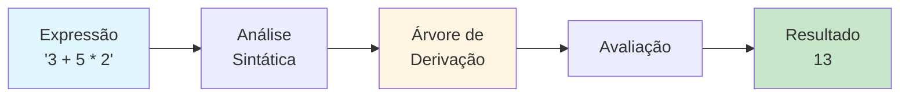
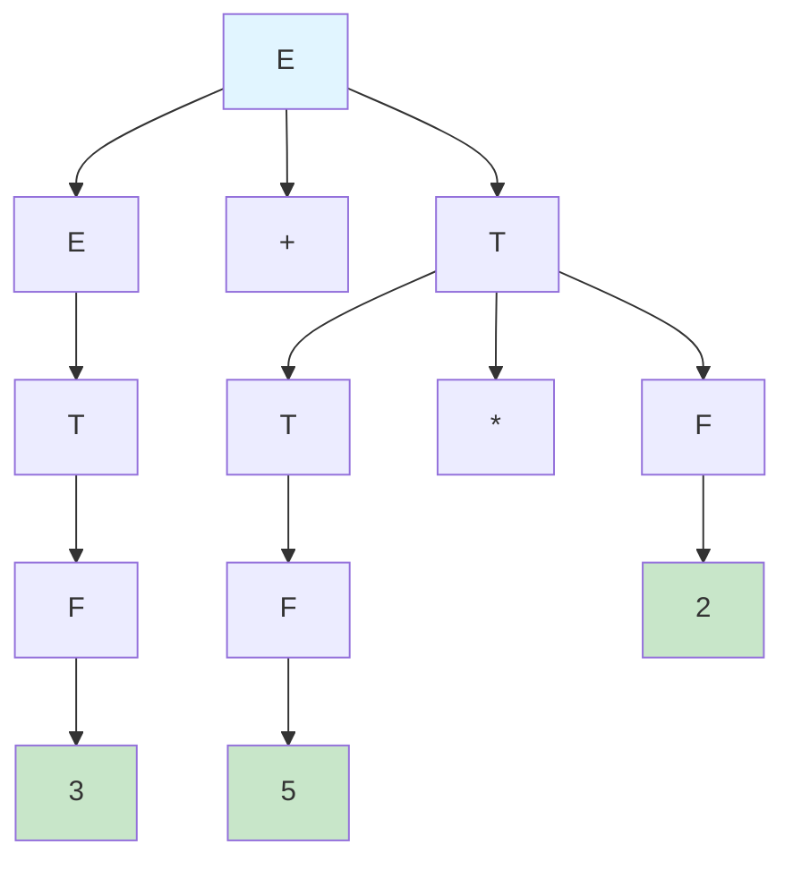
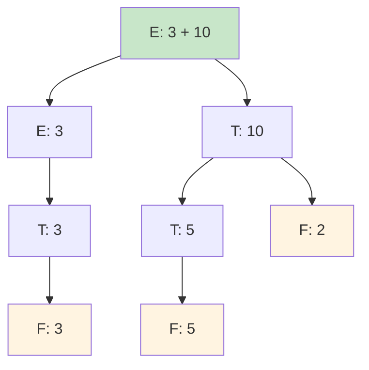
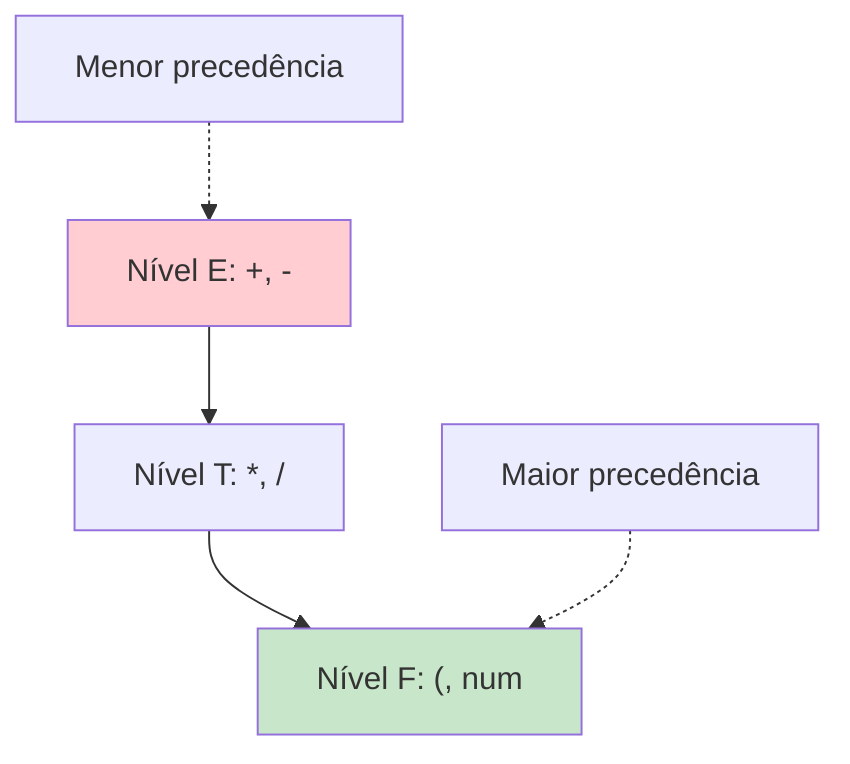
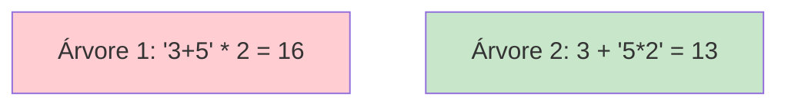
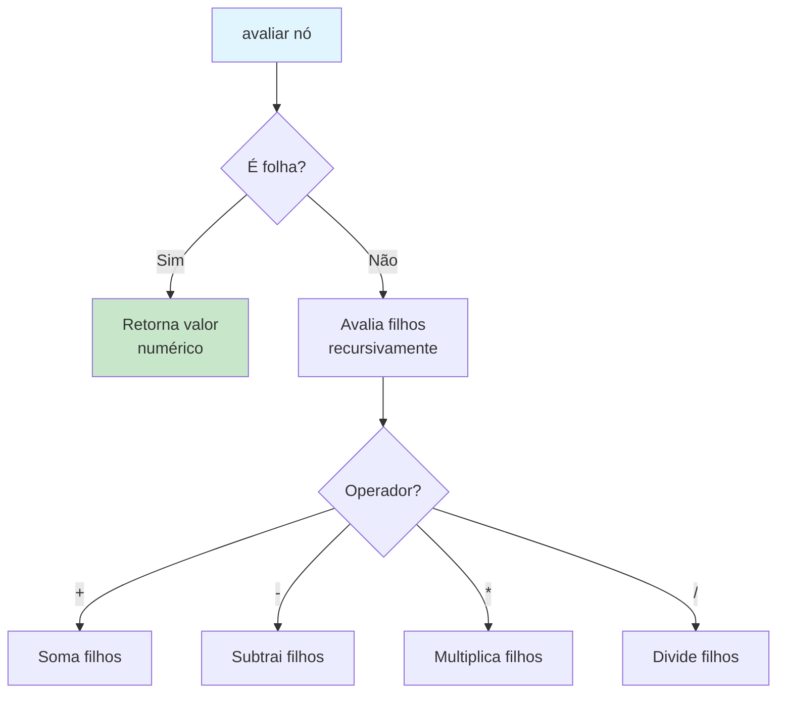
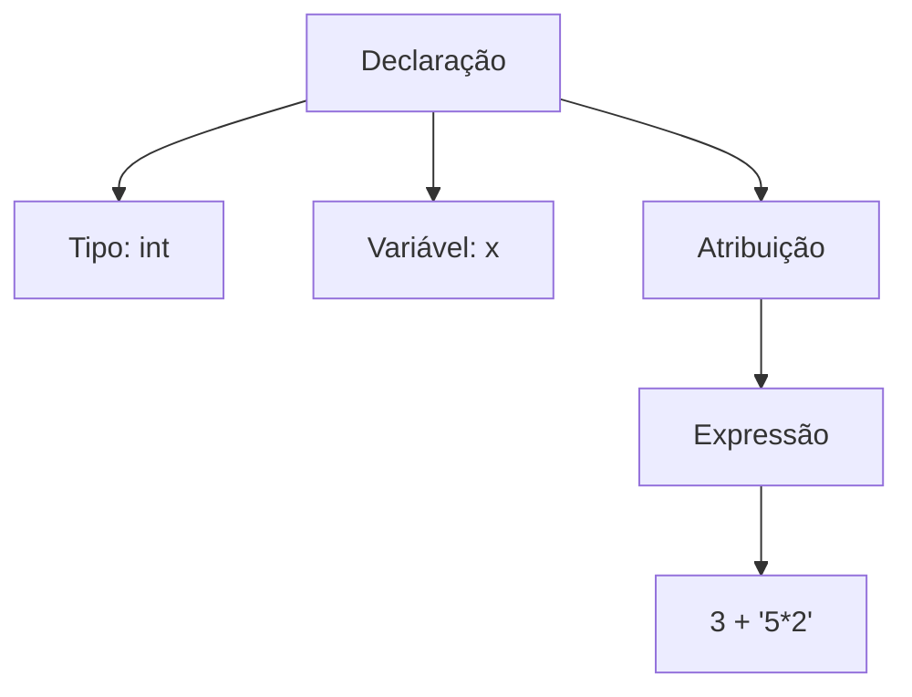
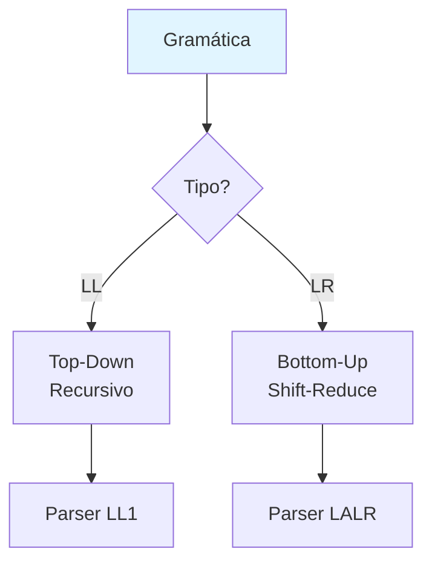
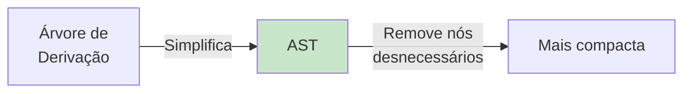
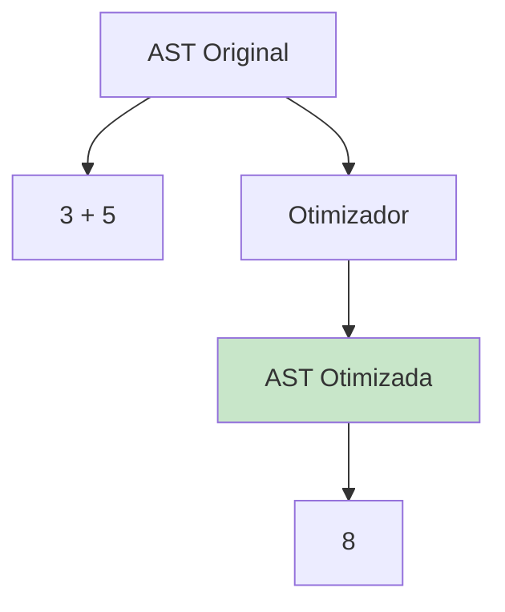

# Aplicações de Árvores de Derivação

Este diretório contém implementação de um avaliador de expressões aritméticas usando árvores de derivação.

## 📚 Conteúdo

- **avaliador_expressoes.c** - Avaliador de expressões aritméticas via árvore sintática

## 🎯 Objetivos de Aprendizado

- Aplicar árvores de derivação em problemas práticos
- Construir e avaliar árvores sintáticas
- Entender análise sintática em compiladores

---

## Avaliador de Expressões (avaliador_expressoes.c)

### O que o Código Faz?

Este programa demonstra uma aplicação prática de **árvores de derivação**: construir e avaliar expressões aritméticas.

**Processo**:
1. Expressão aritmética → Árvore sintática
2. Árvore sintática → Avaliação (resultado numérico)



### Gramática Utilizada

```
E → E + T | E - T | T
T → T * F | T / F | F
F → ( E ) | num
```

**Onde**:
- `E` = Expression (Expressão)
- `T` = Term (Termo)
- `F` = Factor (Fator)
- `num` = número

**Hierarquia de Precedência**:
```
F (maior precedência: parênteses e números)
↓
T (multiplicação e divisão)
↓
E (menor precedência: adição e subtração)
```

### Exemplo: "3 + 5 * 2"

#### Árvore Sintática



#### Avaliação da Árvore



**Cálculo bottom-up** (das folhas para a raiz):
1. F: 3 → valor = 3
2. T: 3 → valor = 3
3. E (esquerda): 3 → valor = 3
4. F: 5 → valor = 5
5. T: 5 → valor = 5
6. F: 2 → valor = 2
7. T: 5 * 2 → valor = 10
8. E: 3 + 10 → **valor = 13** ✓

### Por que a Precedência Está Correta?

A gramática garante que `*` é avaliado antes de `+`:



**5 * 2 é um único T**, então é calculado primeiro!

### Comparação: Gramática Ambígua vs Não-Ambígua

#### Gramática Ambígua (ERRADO)

```
E → E + E | E * E | num
```

**Problema**: `3 + 5 * 2` tem duas interpretações!



#### Gramática Não-Ambígua (CORRETO)

```
E → E + T | T
T → T * F | F
F → num
```

**Solução**: Apenas uma árvore possível = **13** ✓

### Estrutura de Nó da Árvore

```c
typedef struct No {
    char simbolo[16];           // "+", "*", "3", etc.
    struct No *filhos[MAX_FILHOS];  // Filhos na árvore
    int num_filhos;             // Quantidade de filhos
    double valor;               // Valor numérico (para folhas)
} No;
```

### Algoritmo de Avaliação



**Pseudocódigo**:
```
avaliar(no):
    se no é número:
        retorna valor do número
    
    senão se no é operador:
        esquerda = avaliar(filho_esquerdo)
        direita = avaliar(filho_direito)
        
        se operador é '+':
            retorna esquerda + direita
        se operador é '*':
            retorna esquerda * direita
        ...
```

### Para Executar

```bash
make bin/avaliador_expressoes
./bin/avaliador_expressoes
```

### Exemplo de Saída

```
Avaliador de Expressões Aritméticas

Expressão: 3 + 5 * 2

Árvore Sintática:
E
├── E
│   ├── T
│   │   ├── F
│   │   │   └── 3
├── +
├── T
│   ├── T
│   │   ├── F
│   │   │   └── 5
│   ├── *
│   ├── F
│   │   └── 2

Avaliando...
  F(3) = 3
  T = 3
  E(esq) = 3
  F(5) = 5
  T = 5
  F(2) = 2
  T = 5 * 2 = 10
  E = 3 + 10 = 13

Resultado: 13.0
```

---

## 💡 Aplicação em Compiladores

### Pipeline de Compilação


**Análise Sintática (Parsing)**: Construção da árvore de derivação

### Exemplo: Compilador C

```c
int x = 3 + 5 * 2;
```

**Etapas**:

1. **Léxica**: `int`, `x`, `=`, `3`, `+`, `5`, `*`, `2`, `;`

2. **Sintática**: Constrói árvore



3. **Semântica**: Verifica tipos, escopo

4. **Código**: Gera assembly
```asm
mov eax, 5
mul eax, 2    ; 10
add eax, 3    ; 13
mov [x], eax
```

### Tipos de Parsers

#### Top-Down (LL)
```
Começa da raiz → folhas
Exemplo: Parser recursivo descendente
```

#### Bottom-Up (LR)
```
Começa das folhas → raiz
Exemplo: Yacc, Bison
```



## 🔗 Outras Aplicações

### 1. Calculadoras

Calculadoras científicas usam árvores para avaliar expressões:
```
sin(3.14 / 2) + sqrt(16)
```

### 2. Linguagens de Script

Python, JavaScript avaliam código dinamicamente:
```python
eval("3 + 5 * 2")  # Usa parsing interno
```

### 3. Bancos de Dados (SQL)

```sql
SELECT * FROM users WHERE age > 18 AND city = 'SP'
```

Parser constrói árvore para executar query.

### 4. Expressões Regulares

```regex
(a|b)*c+
```

Convertida em árvore para construir autômato.

### 5. Interpretadores

```python
# Interpretador Python
def avaliar(codigo):
    arvore = parse(codigo)
    return executar(arvore)
```

## 📖 Conceitos Avançados

### Árvore Sintática Abstrata (AST)

**Árvore de Derivação** (completa):
```
E → E + T
E → T
T → F
F → 3
```

**AST** (simplificada, sem detalhes gramaticais):
```
   +
  / \
 3   *
    / \
   5   2
```



**AST é usada** na maioria dos compiladores reais!

### Otimização de Código

Compiladores otimizam a AST:

```c
int x = 3 + 5;  // Conhecido em tempo de compilação
```

**Otimização**: Substituir por `int x = 8;`



### Análise Semântica

Verificações feitas após construir a árvore:

```c
int x = "abc";  // ERRO: tipo incompatível
y = 10;         // ERRO: variável não declarada
```

**Percorre AST** verificando:
- Tipos compatíveis
- Variáveis declaradas
- Escopo válido

## 🧮 Complexidade

| Operação | Complexidade |
|----------|-------------|
| Construir árvore | O(n) |
| Avaliar árvore | O(n) |
| Otimizar árvore | O(n) a O(n²) |

onde n = número de nós

## 🎯 Vantagens das Árvores

1. **Precedência natural**: Estrutura garante ordem correta
2. **Reutilizável**: Avaliar, imprimir, otimizar mesma árvore
3. **Extensível**: Adicionar novos operadores facilmente
4. **Debug**: Visualizar estrutura do código

## 💻 Ferramentas Reais

### Geradores de Parsers

- **Yacc/Bison** (C/C++)
- **ANTLR** (Java, C++, Python)
- **PLY** (Python)
- **Tree-sitter** (editor syntax highlighting)

Exemplo ANTLR:
```antlr
expr : expr '+' term
     | term
     ;
term : term '*' factor
     | factor
     ;
factor : '(' expr ')'
       | NUMBER
       ;
```

Gera automaticamente parser + AST!

---

**Conclusão**: Árvores de derivação são fundamentais para processamento de linguagens, desde calculadoras simples até compiladores complexos!
