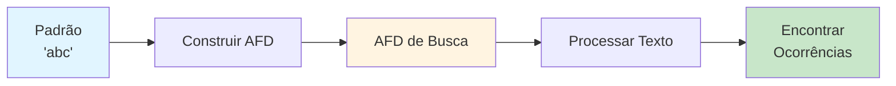
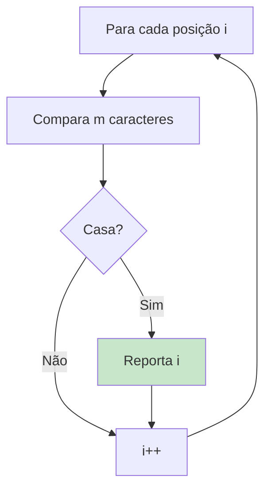
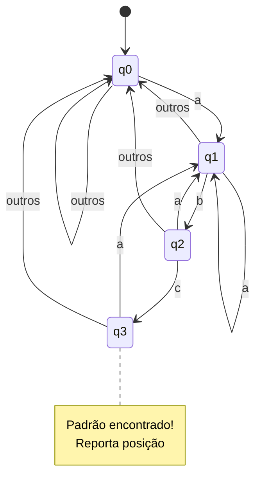
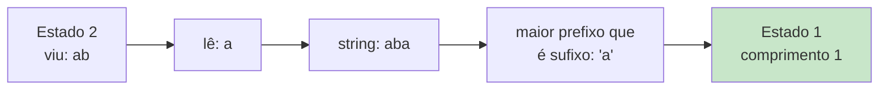
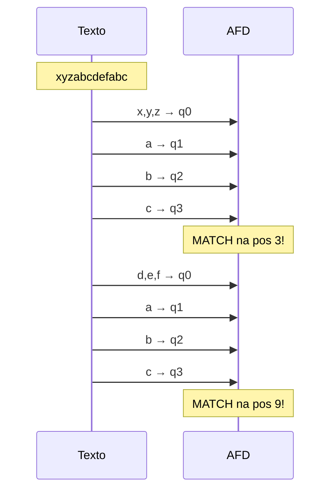
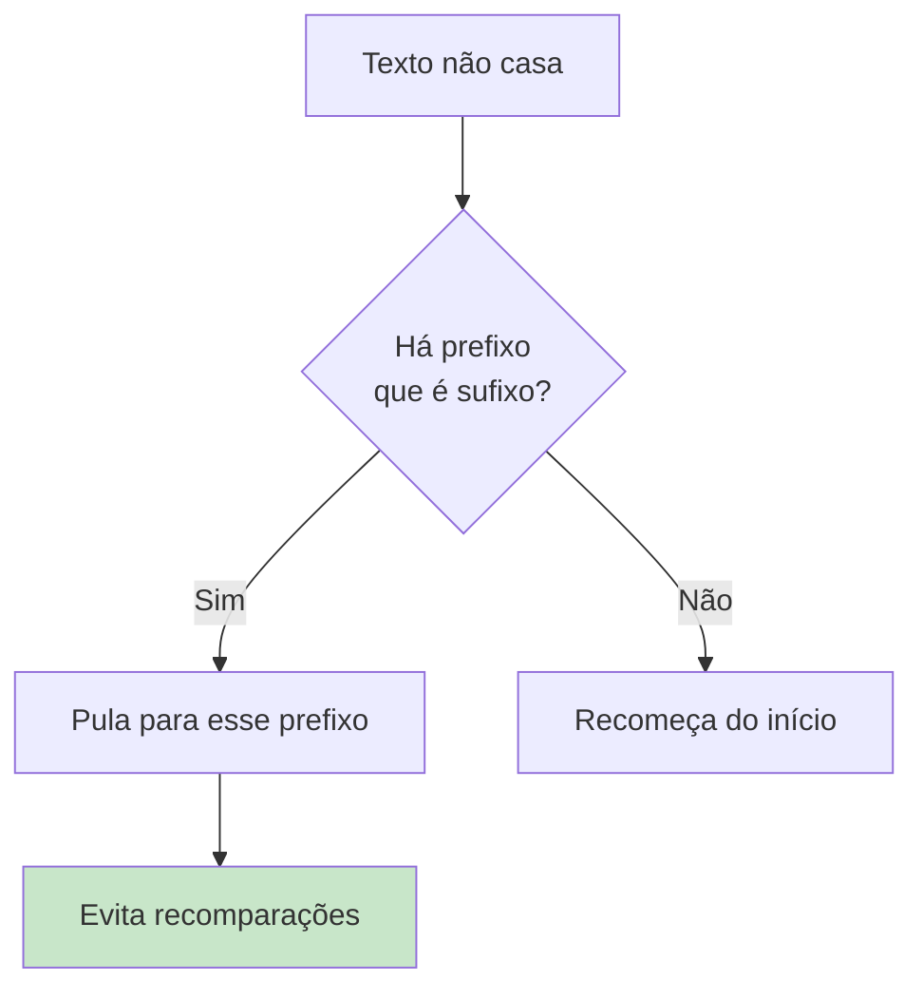
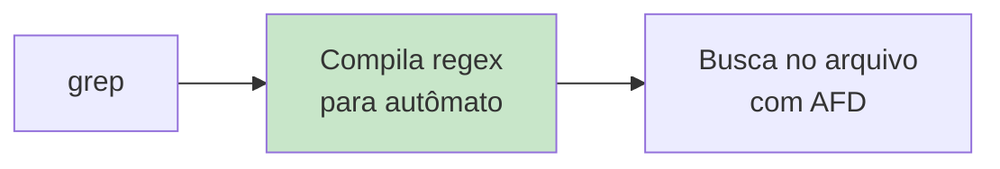
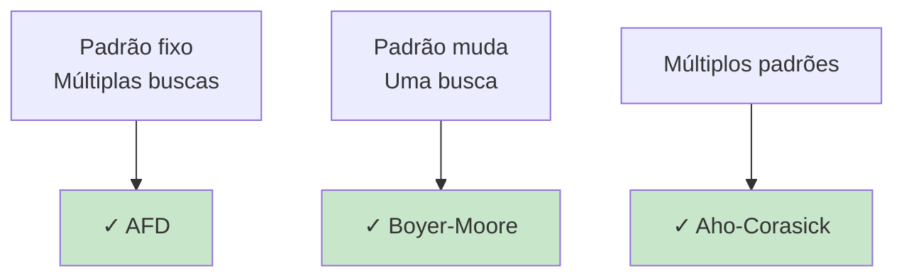
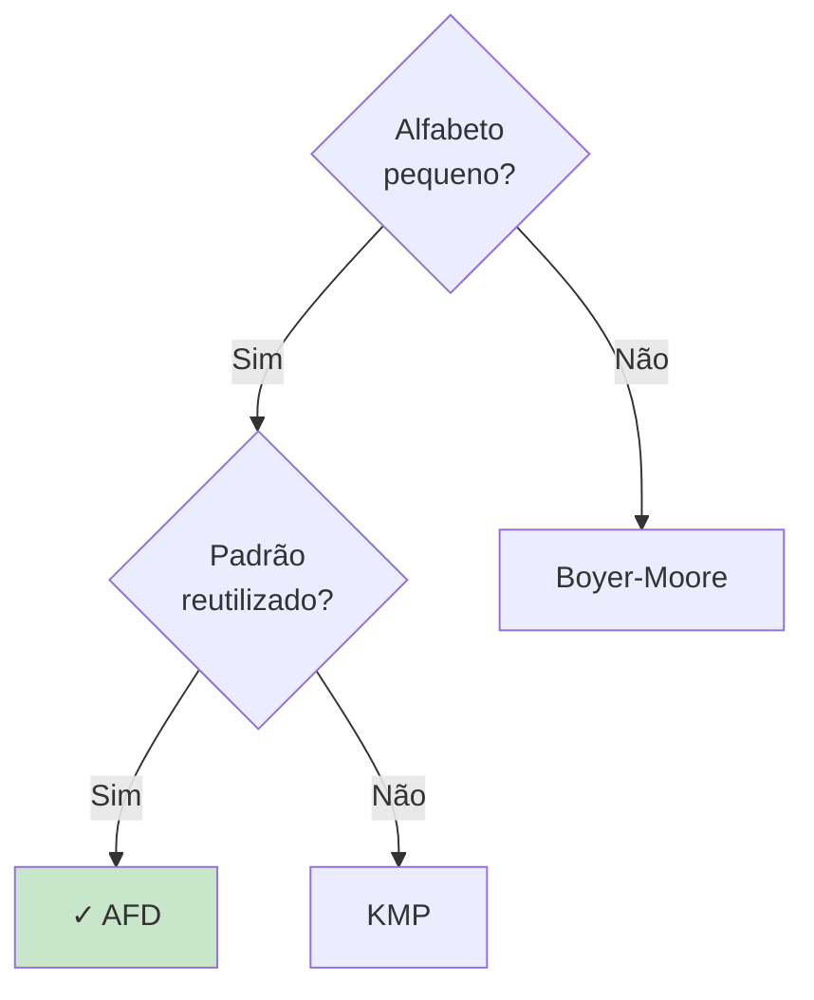
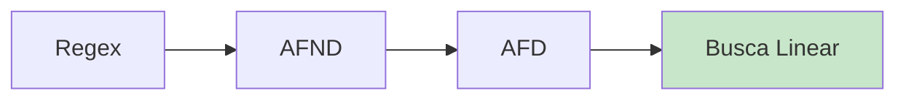

# Aplicações de Autômatos

Este diretório contém implementação de busca de padrões usando autômatos finitos.

## 📚 Conteúdo

- **busca_padrao.c** - Busca de padrões em texto usando AFD

## 🎯 Objetivos de Aprendizado

- Aplicar autômatos em problemas práticos
- Entender algoritmos de busca de padrões
- Conectar teoria com ferramentas reais (grep, find)

---

## Busca de Padrões (busca_padrao.c)

### O que o Código Faz?

Este programa demonstra como **autômatos finitos** podem ser usados para buscar padrões em texto de forma eficiente.

**Aplicação**: Similar ao comando `grep` do Unix/Linux!



### Problema: Busca de Padrão

**Entrada**:
- Padrão P (ex: "abc")
- Texto T (ex: "xyzabcdefabc")

**Saída**:
- Todas as posições onde P ocorre em T

**Exemplo**:
```
Padrão: "abc"
Texto:  "xyzabcdefabc"
         ~~~      ~~~
Posições: 3, 9
```

### Abordagem Naive (Força Bruta)

```c
for (i = 0; i <= n - m; i++) {
    if (texto[i..i+m-1] == padrao)
        reportar(i);
}
```

**Complexidade**: O(n × m)
- n = tamanho do texto
- m = tamanho do padrão



**Problema**: Ineficiente para textos grandes!

### Abordagem com AFD

**Ideia**: Construir um AFD que reconhece strings terminando com o padrão.

**Vantagens**:
- **Complexidade**: O(n) - linear!
- **Preprocessamento**: O(m × |Σ|)
- Cada caractere é lido **apenas uma vez**

```mermaid
flowchart LR
    A[Preprocessamento<br/>O'm × |Σ|'] --> B[Construir AFD]
    B --> C[Busca<br/>O'n']
    
    style C fill:#c8e6c9
```

### Construção do AFD para "abc"

#### Estados do AFD

```
q0 - não viu nada relevante
q1 - viu 'a'
q2 - viu 'ab'
q3 - viu 'abc' (ACEITAÇÃO = encontrou padrão!)
```

#### Diagrama de Estados



#### Tabela de Transições

```
Estado │  a  │  b  │  c  │ outros
───────┼─────┼─────┼─────┼────────
  q0   │ q1  │ q0  │ q0  │  q0
  q1   │ q1  │ q2  │ q0  │  q0
  q2   │ q1  │ q0  │ q3  │  q0
  q3*  │ q1  │ q0  │ q0  │  q0
```

`*` marca estado de aceitação

### Função de Transição δ

Para cada estado `j` e caractere `c`:

```
δ(j, c) = comprimento do maior prefixo de P
          que é também sufixo de P[0..j-1]c
```

**Exemplo**: Padrão "abc"
- Estado 2 (viu "ab"), lê 'a' → vai para estado 1 (viu "a")
- Por quê? "aba" tem maior prefixo-sufixo = "a" (comprimento 1)



### Exemplo de Execução

**Texto**: "xyzabcdefabc"
**Padrão**: "abc"

| Passo | Lê | Estado | Comentário |
|-------|-----|--------|------------|
| 0 | - | q0 | Inicial |
| 1 | x | q0 | Não relevante |
| 2 | y | q0 | Não relevante |
| 3 | z | q0 | Não relevante |
| 4 | a | q1 | Viu 'a' |
| 5 | b | q2 | Viu 'ab' |
| 6 | c | q3 | **ENCONTROU** na posição 3! |
| 7 | d | q0 | Reinicia |
| 8 | e | q0 | - |
| 9 | f | q0 | - |
| 10 | a | q1 | Viu 'a' |
| 11 | b | q2 | Viu 'ab' |
| 12 | c | q3 | **ENCONTROU** na posição 9! |



### Algoritmo KMP (Knuth-Morris-Pratt)

O código usa uma abordagem similar ao **algoritmo KMP**, um dos mais eficientes para busca de padrões.

**Ideia central**: Evitar recomparações desnecessárias usando informação do prefixo do padrão.



### Para Executar

```bash
make bin/busca_padrao
./bin/busca_padrao
```

### Exemplo de Saída

```
Busca de Padrões com Autômato Finito

Padrão: "abc"
Texto:  "xyzabcdefabc"

Construindo AFD...
  Estados: 0 a 3
  Alfabeto: {a, b, c}

Tabela de Transições:
  Estado │  a  │  b  │  c
  ───────┼─────┼─────┼─────
  → 0    │  1  │  0  │  0
    1    │  1  │  2  │  0
    2    │  1  │  0  │  3
   *3    │  1  │  0  │  0

Buscando...
  Posição  3: ...abc...
  Posição  9: ...abc...

2 ocorrências encontradas.
```

---

## 💡 Aplicações Práticas

### 1. Comando grep

```bash
grep "padrão" arquivo.txt
```

**Internamente**: Usa autômatos ou expressões regulares.



### 2. Editores de Texto

```
Ctrl+F "palavra"
```

- Busca incremental
- Realce de ocorrências
- Substituição global

### 3. Detectores de Intrusão (IDS)

```
Buscar padrões de ataques em pacotes de rede
```

- Assinaturas de vírus
- Padrões SQL injection
- XSS patterns

### 4. Bioinformática

```
Buscar sequências de DNA/RNA
```

Exemplo: Encontrar gene específico em genoma:
```
ACGTACGTACGT...
```

### 5. Compiladores - Análise Léxica

```c
while (token = next_token()) {
    // AFD identifica tokens: if, while, int, etc.
}
```

## 🔗 Algoritmos Relacionados

### Comparação de Algoritmos

| Algoritmo | Preprocessamento | Busca | Espaço |
|-----------|------------------|-------|--------|
| Força Bruta | O(1) | O(n×m) | O(1) |
| KMP | O(m) | O(n) | O(m) |
| **AFD** | O(m×\|Σ\|) | **O(n)** | O(m×\|Σ\|) |
| Boyer-Moore | O(m+\|Σ\|) | O(n/m) médio | O(m+\|Σ\|) |
| Rabin-Karp | O(m) | O(n+m) médio | O(1) |

**AFD**: Ideal quando o padrão é fixo e usado múltiplas vezes!



### Algoritmo Aho-Corasick

**Extensão do AFD**: Busca **múltiplos padrões** simultaneamente!

```
Padrões: ["he", "she", "his", "hers"]
Texto: "ushers"
```

Encontra todos de uma vez em O(n + m + z), onde z = ocorrências.

```mermaid
stateDiagram-v2
    [*] --> root
    root --> h : h
    root --> s : s
    h --> e : e
    h --> i : i
    s --> h : h
    e --> [*] : match "he"
    sh --> e : e
    she --> [*] : match "she"
    
    note right of root
        Trie de padrões<br/>+ failure links
    end note
```

### Boyer-Moore

**Estratégia**: Pula caracteres baseado no último caractere do padrão.

```
Texto:   "WHICH_FINALLY_HALTS_AT_THIS_POINT"
Padrão:  "AT_THIS"
         ^^^^^^^ não casa no final
         pula 7 posições!
```

**Melhor caso**: O(n/m) - sublinear!

## 🧮 Análise de Complexidade

### Construção do AFD

```
Tempo: O(m × |Σ|)
Espaço: O(m × |Σ|)
```

- m = tamanho do padrão
- |Σ| = tamanho do alfabeto

**Para alfabeto pequeno** (ex: DNA = {A,C,G,T}): Muito eficiente!

### Busca com AFD

```
Tempo: O(n)
Espaço: O(1) (além do AFD)
```

- n = tamanho do texto
- **Linear**: Cada caractere processado uma vez
- **Ótimo**: Não é possível fazer melhor que O(n)!

## 🎯 Quando Usar AFD para Busca

### ✓ Vantagens

1. **Eficiência**: O(n) garantido
2. **Simplicidade**: Implementação clara
3. **Reutilizável**: AFD pode ser salvo e reutilizado
4. **Previsível**: Sem pior caso ruim

### ✗ Desvantagens

1. **Espaço**: O(m × |Σ|) pode ser grande
2. **Preprocessamento**: Lento para padrões grandes
3. **Alfabeto grande**: Unicode tem milhares de caracteres

### Quando Usar



**Use AFD quando**:
- Alfabeto pequeno (DNA, binário)
- Mesmo padrão buscado muitas vezes
- Precisa de desempenho garantido O(n)

## 📖 Expressões Regulares

**Grep extendido**: Suporta regex completas!

```bash
grep -E "ab+c*" arquivo.txt
```

**Internamente**:
1. Regex → AFND (Thompson)
2. AFND → AFD (Construção de Subconjuntos)
3. AFD → Busca O(n)



## 🌟 Curiosidade

### Google Search

- Indexa trilhões de páginas
- Usa autômatos para busca eficiente
- Combina com árvores de sufixo e hash

### Antivírus

- Milhares de assinaturas de vírus
- Aho-Corasick procura todas simultaneamente
- Escaneamento em tempo real

### Sequenciamento de DNA

- Genoma humano: 3 bilhões de pares base
- Algoritmos de busca encontram genes
- AFDs são fundamentais na bioinformática moderna

---

**Conclusão**: Autômatos finitos transformam busca de padrões de O(n×m) para **O(n)** - uma melhoria dramática usada em ferramentas que você usa todos os dias!
